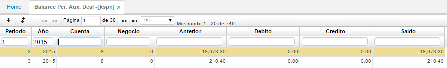

## Saldo Per. Aux. Negocio - KSPN

Esta aplicación nos permite visualizar los saldos periódicamente filtrando por negocio el cual debe estar parametrizado en la aplicación Negocio **BNEG - Negocios**.

**Periodo:** Valor numérico que identifica al mes.  
**Año:** Año al cual se va a realizar la consulta.  
**Cuenta:** Identificación numérica y nombre de la cuenta.  
**Negocio:** Identificación numérica del negocio al cual pertenece la cuenta.  
**Anterior:** Valor que posee la cuenta antes de iniciar el periodo.  
**Debito:** Valor numérico de los movimientos débitos que se realizan durante el periodo.  
**Crédito:** Valor numérico de los movimientos créditos que se realizan durante el periodo.  
**Saldo:** Valor que tendrá la cuenta después de terminar el periodo.  

