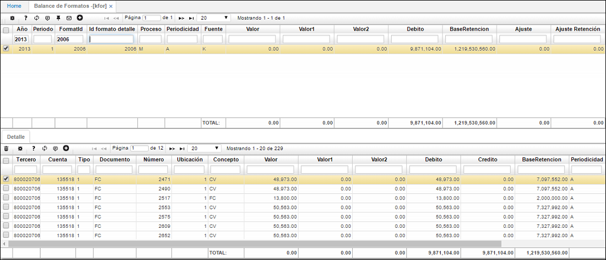
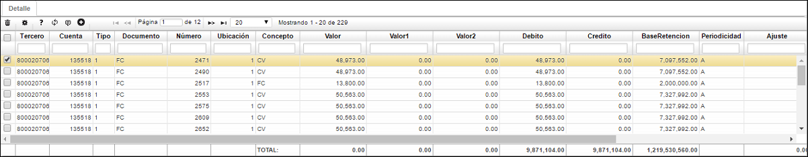

## Balance de Formatos - KFOR

En esta aplicación el sistema mostrará la información generada anteriormente en la aplicación [**KPGF - Genera Formatos**](http://docs.oasiscom.com/Operacion/erp/contabilidad/kproceso/kpgf) , consultamos por año, número de formato asignado en la aplicación [**KBFO - Formatos**](http://docs.oasiscom.com/Operacion/erp/contabilidad/kbasica/kbfo) y damos _Enter_.  

El valor indicado en el maestro debe coincidir con el Balance de Prueba.  

Es importante validar que en el maestro de la aplicación aparezca la información de los campos _Proceso, Periodicidad y Fuente_, la cual fue parametrizada anteriormente en  [**KBFO - Formatos**](http://docs.oasiscom.com/Operacion/erp/contabilidad/kbasica/kbfo).

En el detalle de esta aplicación se observará la información discriminada por tercero y cuenta.  

Se debe validar que en la aplicación [**KPME - Medios Magnéticos**](http://docs.oasiscom.com/Operacion/erp/contabilidad/kmedios/kpme) también haya generado información.

## [Verificación de la información generada en los medios magnéticos correspondientes al Ingreso de Activo Fijo por Compras](http://docs.oasiscom.com/Operacion/erp/contabilidad/kbasica/kbfo#verificación-de-la-información-generada-en-los-medios-magnéticos-correspondientes-al-ingreso-de-activo-fijo-por-compras)

Generados los medios magnéticos previamente en la aplicación 

