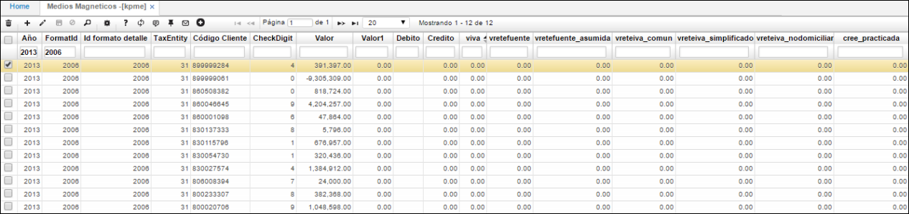

## Medios Magnéticos - KPME

En la aplicación KPME - Medios Magénticos, se valida información generada al ejecutar anteriormente el proceso en [**KPGF - Genera Formatos**](https://github.com/OasisCom/Docs/blob/master/Operacion/erp/contabilidad/kproceso/kpgf.md), información que será cargada posteriormente en la interfaz..

Otra aplicación en la cual se puede validar que el proceso ejecutado en [**KPGF - Genera Formatos**](https://github.com/OasisCom/Docs/blob/master/Operacion/erp/contabilidad/kproceso/kpgf.md) haya generado información es [**KRFD - Formatos Detallados**](https://github.com/OasisCom/Docs/blob/master/Operacion/erp/contabilidad/kmedios/krfd.md).

