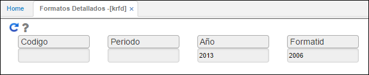
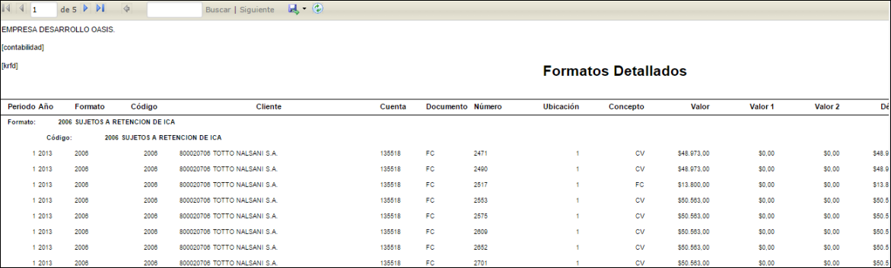

## Formatos Detallados - KRFD

En la aplicación KRFD - Formatos Detallados se valida la información generada al ejecutar anteriormente el proceso en [**KPGF - Genera Formatos**](https://github.com/OasisCom/Docs/blob/master/Operacion/erp/contabilidad/kproceso/kpgf.md), dicha información es primordial verificarla, puesto que, se cruzará con el módulo de contabilidad para comprobar que esté correcta.

Se consulta ingresando el año de generación, número de formato y dando click en el botón  _Generar_ .  

Generado el formato, el sistema arrojará un reporte como el siguiente en donde se validará la información de tercero, cuenta, documento, entre otros.  

El sistema permite descargar la información del reporte en diferentes formatos como Excel, PDF y Word para facilitar la comparación.  

Otra aplicación para validar que el proceso ejecutado en [**KPGF - Genera Formatos**](https://github.com/OasisCom/Docs/blob/master/Operacion/erp/contabilidad/kproceso/kpgf.md) haya generado información es [**KRFO - Formatos**](https://github.com/OasisCom/Docs/blob/master/Operacion/erp/contabilidad/kmedios/krfo.md).

