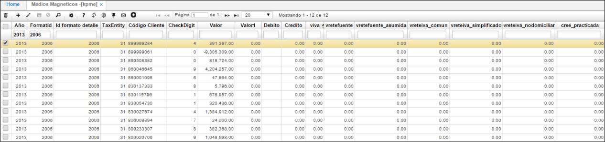

## Formatos Detallados - KRFD

En la aplicación KRFD - Formatos Detallados, se valida información generada al ejecutar anteriormente el proceso en [**KPGF - Genera Formatos**](https://github.com/OasisCom/Docs/blob/master/Operacion/erp/contabilidad/kproceso/kpgf.md), información que será cargada posteriormente en la interfaz..

Otra aplicación para validar que el proceso ejecutado en [**KPGF - Genera Formatos**](https://github.com/OasisCom/Docs/blob/master/Operacion/erp/contabilidad/kproceso/kpgf.md) haya generado información es 

