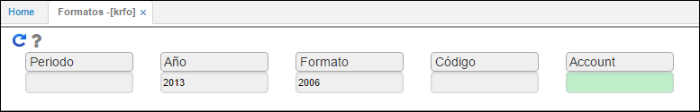
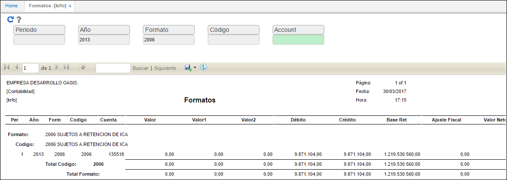

# Formatos - KRFO

Formatos  - KRFO  es una de la aplicaciones en donde se valida la información generada al ejecutar anteriormente el proceso en [**KPGF - Genera Formatos**](http://docs.oasiscom.com/Operacion/erp/contabilidad/kproceso/kpgf), dicha información es desglosada por cuenta y concepto, haciéndola más explícita.

Se consulta ingresando el año de generación, número de formato y dando clic en el botón  _Generar_ .  

Generado el formato, el sistema arrojará un reporte como el siguiente en donde se podrá observar la información de manera más detallada por cuenta.  

El sistema permite descargar la información del reporte en diferentes formatos como Excel, PDF y Word.  

Cuando la información generada en el proceso [**KPGF - Genera Formatos**](http://docs.oasiscom.com/Operacion/erp/contabilidad/kproceso/kpgf) ha sido validada en las aplicaciones correspondientes, se procederá a compararla con la información de los reportes del módulo de contabilidad para tener certeza que lo que se cargará en el prevalidado está correcto. Una de esas aplicaciones es [**KMCM - Consulta de Movimientos**](http://docs.oasiscom.com/Operacion/erp/contabilidad/kmovimient/kmcm).  

