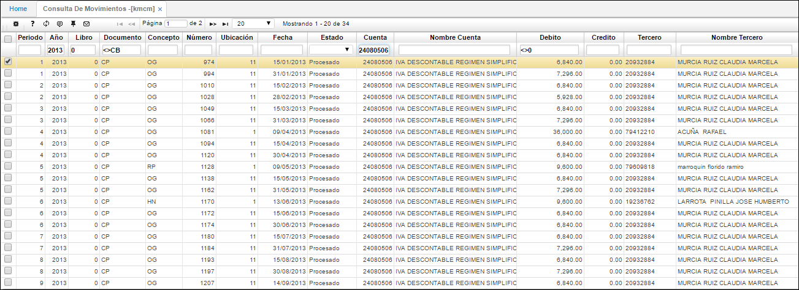

## Consulta de Movimientos - KMCM

El objetivo de esta aplicación es poder consultar los movimientos realizados en el módulo de contabilidad.

Se consulta por año de ejecución, documento, número de cuenta contable y damos en _Enter_.

**Documento:** Especificación del documento origen que da comienzo a un movimiento.  
**Número:** Consecutivo en el cual se generó el comprobante.  
**Ubicación:** Identificación numérica de la ubicación de un punto de la empresa.  
**Concepto:** Identificación alfanumérica y nombre del concepto.  
**Fecha:** Fecha en la cual se elaboró el comprobante.  
**Estado:** Estado en el cual se encuentra el comprobante.  
**Renglón:** Número del consecutivo en el cual se encuentra una determinada cuenta de un comprobante.  
**Cuenta:** Identificación numérica y nombre de la cuenta que es afectada por el concepto.  
**Débito:** Si el valor es débito.  
**Crédito:** Si el valor es crédito.  
**Valor:** Valor que es asignado a la cuenta dependiendo de la naturaleza.  
**Tercero:** Identificación numérica del tercero.  
**Centro costo:** Identificación del centro de costo al que pertenece la cuenta.  
**Negocio:** Identificación numérica del tipo de negocio que maneja la empresa.  
**Proyecto:** Identificación numérica del proyecto.  
**BaseRetencion:** Valor de retención que se le aplica a un concepto.  
**Periodo:** Identificación numérica del mes del documento origen.  
**Año:** Año en el que se realiza el documento origen.  

La información arrojada por esta aplicación servirá de comparación para con la información generada en [**KPGF - Generar Formatos**](http://docs.oasiscom.com/Operacion/erp/contabilidad/kproceso/kpgf), la cual se puede validar en diferentes aplicaciones como lo son: [**KFOR - Balance de Formatos**](http://docs.oasiscom.com/Operacion/erp/contabilidad/kformatos/kfor), [**KPME - Medios Magnéticos**](http://docs.oasiscom.com/Operacion/erp/contabilidad/kmedios/kpme), [**KRFD - Formatos Detallados**](http://docs.oasiscom.com/Operacion/erp/contabilidad/kmedios/krfd), [**KRFO - Formatos**](http://docs.oasiscom.com/Operacion/erp/contabilidad/kmedios/krfo). Comparada la información generada en KPGF con la información del módulo de Contabilidad, se deberá ingresar a la aplicación [**BINT - Interfaces**](http://docs.oasiscom.com/Operacion/utility/barchi/bint#medios-magn%C3%A9ticos) a descargar el archivo que se enviará a la entidad correspondiente.  

