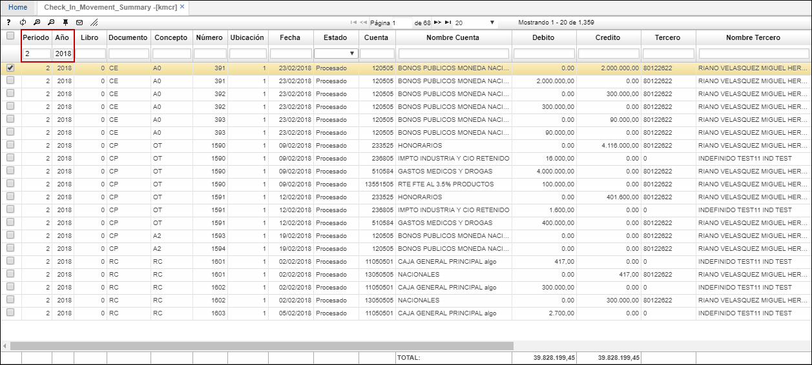

# KMCR - Consulta de Movimientos Resumidos

La aplicación **KMCR** permite ver resumidamente la información correspondiente a la contabilización. Podremos ver los movimientos que se realizaron por cada documento y sus características.  

A continuación, filtraremos la contabilización del periodo 2 (febrero) y del año 2018.  

