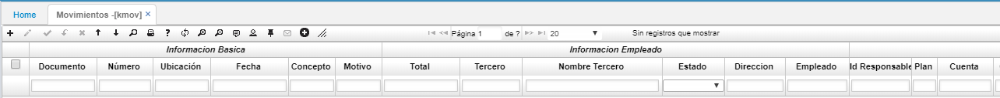
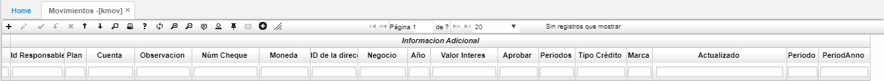
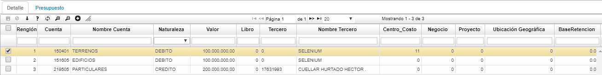
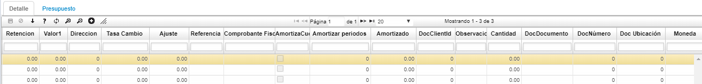
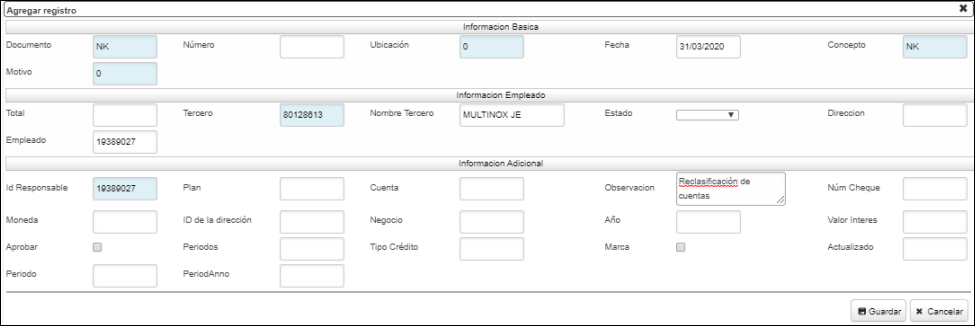
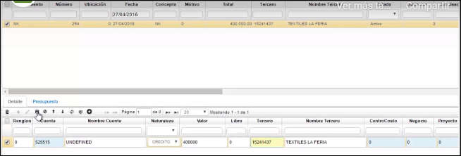
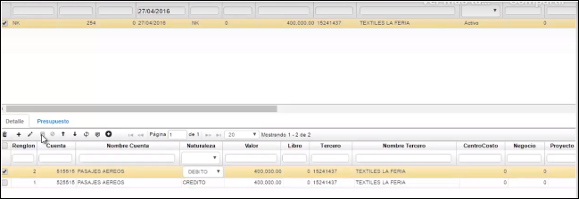
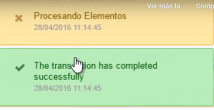

## Movimientos - KMOV

Esta aplicación nos permite visualizar los saldos periódicamente de los proyectos, se puede filtrar por año, cuenta y proyecto. En la aplicación **KMOV** se generan diversos comprobantes, para ello se requieren ciertos datos de entrada como: número de la ubicación que genera el comprobante, identificación alfanumérica del comprobante a generar, valor por el cual se va realizar el movimiento.  

El sistema mediante procesos internos genera automáticamente los diferentes comprobantes contables, actualizando consigo las diferentes cuentas contables (débitos y créditos), cuando se realiza un proceso especifico como depreciaciones, amortizaciones o distribución de costos.    

  

 **Documento:** Tipo de documento.  
 **Número:** Número del documento.  
 **Ubicación:** Ubicación donde se alamcenará el documento.  
 **Fecha:** Fecha en que se realiza el documento.  
 **Concepto:** Concepto por el cual se realiza el documento.  
 **Motivo:** número que identifica un documento para casos especiales a nivel    contable, se puede parametrizar los documentos por conceptos en la aplicación BDOC, los motivos se parametrizan desde la aplicación BPLA.  
 **Total:** Valor total del documento.  
 **Tercero:** Número de identificación del tercero al que se realiza el documento.  
 **Nombre tercero:** Nombre del tercero al que se le realiza el documento.  
 **Estado:** Estado del documento: Activo, Procesado, Anulado.  

En la pestaña de detalle se especifica el documento origen por el cual se está generando el comprobante.    

  

 **Renglón:** Consecutivo del renglón.  
 **Cuenta:** Número de cuenta según PUC (Plan Único de Cuentas).  
 **Nombre cuenta:** Nombre de cuenta según PUC (Plan Único de Cuentas).  
 **Naturaleza:** Naturaleza de la cuenta: Débito, Crédito.  
 **Valor:** Valor a registrar en cuenta.  
 **Tercero:** Número de identificación del tercero a quien corresponde el registro.  
 **Nombre de tercero:** Nombre del tercero a quien corresponde el registro.  
 **Centro costo:** Centro de costo a quien se carga el registro.  
 **Negocio:** Número de negocio.  
 **ProyectId:** Número de proyecto.  
 **BaseRetencion:** Valor de retención que se le aplica a un concepto.  
 
 
## Nota de Contabilidad  

Las notas de contabilidad se usan para realizar cualquier registro contable para cuentas que no son controladas por módulos del sistema.  
En este ejemplo, se va a realizar una nota de contabilidad por un mal registro causado en el mes de abril donde se causó el gasto; se causó al gasto de ventas y realmente era un gasto administrativo.  
Adicionamos un nuevo registro.  

**Documento:**  Podemos buscar por el zoom y escoger la opción NK de Nota de contabilidad  
**Concepto:** También escogemos NK al igual que en el campo documento  
**Motivo:** 0 (cero) indefinido  
**Total:**  Diligenciamos el total del gasto a reclasificar  
**Tercero:**  Podemos buscar por el zoom o diligenciar el NIT del tercero si ya lo conocemos  
**Observación:**  Diligenciamos la causa de la nota de contabilidad que en este ejemplo sería Reclasificación de cuentas.  

Ahora, guardamos el registro.  

Posteriormente, se crea el detalle:   

Se adiciona una nueva fila en el detalle  

  

**Cuenta:** Se diligencia el código de la cuenta en la que se diligenció el error  
**Nombre cuenta:** La misma relacionada con el código que se diligencia automáticamente  
**Naturaleza:** Ya que es la cuenta de la que vamos a retirar el dinero causado, la vamos a registrar con la naturaleza contraria de su respectiva parametrización en **BCUE**  
**Valor:** El mismo dato que colocamos arriba en el maestro  
**Tercero:** El mismo dato que colocamos arriba en el maestro  

Guardamos el registro.  

Ahora, adicionamos otra fila donde crearemos la reclasificación, es decir, escribimos los datos donde realmente debería ir el registro:  
  

**Cuenta:** El código donde realmente va el registro  
**Nombre cuenta:** De acuerdo al código diligenciado  
**Naturaleza:** Se oprime tab y el sistema escribe automáticamente  
**Valor:** Mismo valor  
**Tercero:** Mismo tercero  

Se guarda el registro.

Luego de guardado el registro, se procesa desde el maestro

  

Si queremos verificar que se haya efectuado el documento, podemos consultar la aplicación [**KRAX - Libro Auxiliar Detallado**](http://docs.oasiscom.com/Operacion/erp/contabilidad/kreporte/krax) 

En esta aplicación se tiene la posibilidad de consultar de diferentes formas; puede ser, con el número de cuenta en el campo **Cuenta** y la aplicación nos mostrará un resumen de todos los movimientos realizados con esta cuenta

