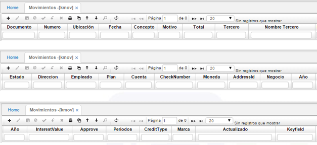
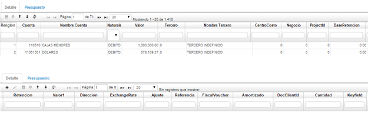

## Movimientos - KMOV

Esta aplicación nos permite visualizar los saldos periódicamente de los proyectos, se puede filtrar por año, cuenta y proyecto. En la aplicación **KMOV** se generan diversos comprobantes, para ello se requieren ciertos datos de entrada como: número de la ubicación que genera el comprobante, identificación alfanumérica del comprobante a generar, valor por el cual se va realizar el movimiento.  

El sistema mediante procesos internos genera automáticamente los diferentes comprobantes contables, actualizando consigo las diferentes cuentas contables (débitos y créditos), cuando se realiza un proceso especifico como depreciaciones, amortizaciones o distribución de costos.  

 **Documento:** Tipo de documento.  
 **Número:** Número del documento.  
 **Ubicación:** Ubicación donde se alamcenará el documento.  
 **Fecha:** Fecha en que se realiza el documento.  
 **Concepto:** Concepto por el cual se realiza el documento.  
 **Motivo:** número que identifica un documento para casos especiales a nivel    contable, se puede parametrizar los documentos por conceptos en la aplicación BDOC, los motivos se parametrizan desde la aplicación BPLA.  
 **Total:** Valor total del documento.  
 **Tercero:** Número de identificación del tercero al que se realiza el documento.  
 **Nombre tercero:** Nombre del tercero al que se le realiza el documento.  
 **Estado:** Estado del documento: Activo, Procesado, Anulado.  

En la pestaña de detalle se especifica el documento origen por el cual se está generando el comprobante.  

 **Renglón:** Consecutivo del renglón.  
 **Cuenta:** Número de cuenta según PUC (Plan Único de Cuentas).  
 **Nombre cuenta:** Nombre de cuenta según PUC (Plan Único de Cuentas).  
 **Naturaleza:** Naturaleza de la cuenta: Débito, Crédito.  
 **Valor:** Valor a registrar en cuenta.  
 **Tercero:** Número de identificación del tercero a quien corresponde el registro.  
 **Nombre de tercero:** Nombre del tercero a quien corresponde el registro.  
 **Centro costo:** Centro de costo a quien se carga el registro.  
 **Negocio:** Número de negocio.  
 **ProyectId:** Número de proyecto.  
 **BaseRetencion:** Valor de retención que se le aplica a un concepto.  

