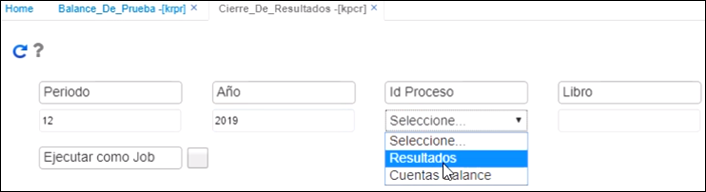

## Cierre de Resultados - KPCR

En esta opción se realiza el cierre de resultados al finalizar el ejercicio, pero para ello es necesario realizar una serie de parametrizaciones básicas que se describen a continuación.  

Para esto, dentro de la aplicación **BCUE - Cuentas** es necesario buscar las cuentas de utilidad y perdida del ejercicio, generalmente dentro del plan de cuentas para comerciantes estas cuentas son la 3605 y la 3610 respectivamente.  

Una vez encontremos o agreguemos las cuentas de utilidad y perdida del ejercicio _–recuerde que el nivel de las mismas depende de la política contable de su empresa, sobre todo para definir la imputación de estas cuentas-_ es muy importante fijarse que estas cuentas estén marcadas con el ítem de utilidad en el campo utilidad, ubicado en la zona derecha de la tabla de cuentas contables **BCUE - Cuentas**.  

Cuando se hayan hecho las modificaciones y guardado los cambios correspondientes es el momento de cerrar el año, para esto se ejecuta el proceso de cierre de resultados **KPCR**.  

Al ingresar a esta aplicación, se despliega una ventana como la que se muestra a continuación:  

Se deberá ingresar la siguiente información:  

**Periodo:** ingresar el periodo 12, correspondiente al mes de diciembre.  
**Año:** digitar el año inmediatamente anterior al cual se le realizará el cierre correspondiente.  
**Proceso:** seleccionar de la lista desplegable el proceso al cual se le realizará cierre (Cierre de resultados o cierre de cuentas de balance).  
**Libro:** Ingresar el libro al cual se le realizará el cierre, 1 para libro IFRS y 0 para el libro contable local. Tener en cuenta que se debe realizar el cierre en los dos libros contables.  

