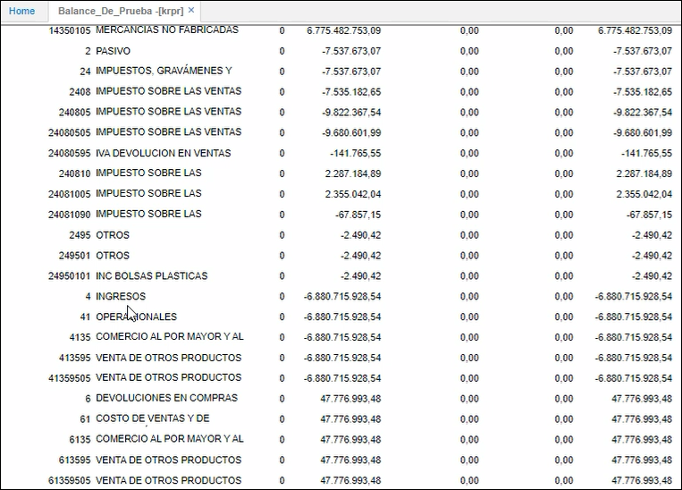

# Cierre de Resultados - KPCR

La opción Cierre de Resultados se realiza  al finalizar el cierre de año, pero para ello es necesario realizar una serie de parametrizaciones básicas que se describen a continuación.  

>+ [KRPR - Balance de Prueba](http://docs.oasiscom.com/Operacion/erp/contabilidad/kreporte/krpr)
>+ [KPCR - Cierre de Resultados](http://docs.oasiscom.com/Operacion/erp/contabilidad/kproceso/kpcr#kpcr---cierre-de-resultados)
>+ [KMOV - Movimientos](http://docs.oasiscom.com/Operacion/erp/contabilidad/kmovimient/kmov)

Para esto, dentro de la aplicación [**BCUE - Cuentas**](http://docs.oasiscom.com/Operacion/common/bfinan/bcue) es necesario buscar las cuentas de utilidad y perdida del ejercicio, generalmente dentro del plan de cuentas para comerciantes estas cuentas son la 350 y la 300 respectivamente.  

Una vez encontremos o agreguemos las cuentas de utilidad y perdida del ejercicio _recuerde que el nivel de las mismas depende de la política contable de su empresa, sobre todo para definir la imputación de estas cuentas_ es muy importante fijarse que estas cuentas estén marcadas con el ítem de utilidad en el campo utilidad, ubicado en la zona derecha de la tabla de cuentas contables [**BCUE - Cuentas**.](http://docs.oasiscom.com/Operacion/common/bfinan/bcue)  

Para esto, dentro de la aplicación [**KRPR - Balance de prueba**](http://docs.oasiscom.com/Operacion/erp/contabilidad/kreporte/krpr) es necesario buscar las cuentas de ingresos, costos y gastos del balance de prueba, ya que generalmente estas se encuentran aun con saldo.

## [KPCR - Cierre de Resultados](http://docs.oasiscom.com/Operacion/erp/contabilidad/kproceso/kpcr#kpcr---cierre-de-resultados)
Para proceder a realizar el cierre, se ejecuta el proceso de cierre de resultados en la aplicación **KPCR - Cierre de Resultados**.

Al ingresar a esta aplicación, se despliega una ventana como la que se muestra a continuación:  

Se deberá ingresar la siguiente información:  

**Periodo:** ingresar el periodo 12, correspondiente al mes de diciembre.  
**Año:** digitar el año inmediatamente anterior al cual se le realizará el cierre correspondiente.  
**Proceso:** seleccionar de la lista desplegable el proceso al cual se le realizará cierre (Cierre de resultados o cierre de cuentas de balance).  
**Libro:** Ingresar el libro al cual se le realizará el cierre, 1 para libro IFRS y 0 para el libro contable local. Tener en cuenta que se debe realizar el cierre en los dos libros contables.  

Posteriormente se diligencian los campos correspondientes, damos clic  y ejecutamos el proceso. 

El sistema genera un documento **NK** con concepto **UP** en el [KMOV - Movimientos](http://docs.oasiscom.com/Operacion/erp/contabilidad/kmovimient/kmov). 

**Nota:** Las cuentas que genera el documento necesitan de un tercero para ser procesado.

Para crear el tercero clic  modificar registro. 

Luego de seleccionar el tercero, clic guardar cambios. Posteriormente se procesa el documento. 

Despues de realizar el cierre en la aplicación **KMOV - Movimientos**, se procede a consultar el [KRPR - Balance de Prueba](http://docs.oasiscom.com/Operacion/erp/contabilidad/kreporte/krpr), las cuentas gastos, ingresos, costo de ventas y costo de producción ya aparecen cerradas o en cero. 

