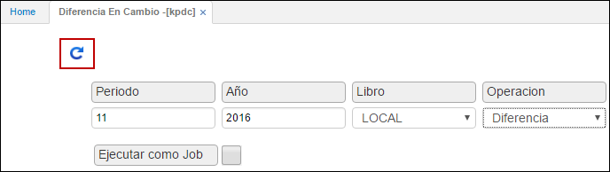

## Diferencia en Cambio - KPDC

En esta aplicación se lleva a cabo el proceso de diferencia en cambio, para ello debe realizarse una serie de parametrizaciones, las cuales se indican a continuación.

Para efectuar el proceso de diferencia en cambio, en primer lugar, parametrizaremos el tipo de moneda en la aplicación _BMON – Moneda_, para conocer la parametrización por favor dirígase a la aplicación **BMON**.

Parametrizado el tipo de moneda en la aplicación **BMON**, ingresamos a la aplicación **KPDC** en donde ejecutaremos la Diferencia en Cambio.

**Periodo:** digitar el número del mes del cual se va a generar la diferencia en cambio.  
**Año:** año en el cual se va a generar la diferencia en cambio.  
**Libro:** seleccionar de la lista desplegable si la diferencia en cambio se generará para libro local o libro IFRS. Si se desea realizar la diferencia en cambio para los dos libros contables, se debe generar el proceso por cada libro.  

**Operación:** seleccionar de la lista desplegable la operación Diferencia.  

Diligenciados los campos damos click en el botón ejecutar.  

Ejecutado el proceso, el sistema automáticamente creará un documento **NK** con concepto **DC** en la aplicación _KMOV_, allí se debe verificar que el proceso se haya generado correctamente y que las cuentas contables en el detalle del documento sean las correctas. Una vez verificado lo anterior, se debe procesar el documento.

