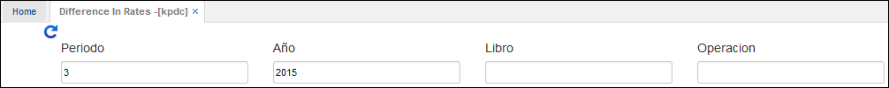
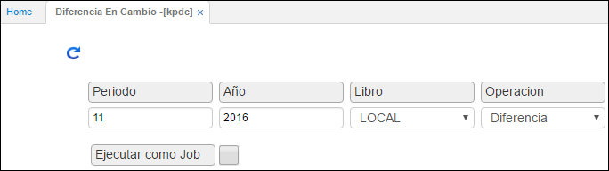
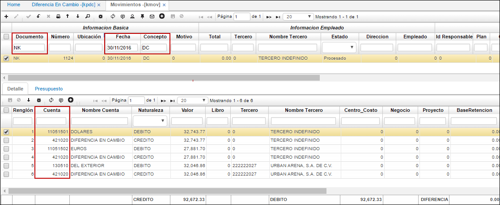

## Diferencia en Cambio - KPDC

En esta aplicación se lleva a cabo el proceso de diferencia en cambio, para ello debe realizarse una serie de parametrizaciones, las cuales se indican a continuación.

Para efectuar el proceso de diferencia en cambio, en primer lugar, parametrizaremos el tipo de moneda en la aplicación _BMON – Moneda_. En el maestro seleccionamos la moneda, en este caso Dólares y nos dirigimos al detalle.

En el detalle agregamos un nuevo renglón, diligenciamos los campos y damos click en guardar.

**Moneda:** tipo de moneda seleccionada en el maestro.  
**Fecha:** seleccionar la fecha del último día del mes.  
**Valor:** digitar el valor en pesos en el cual se encuentra el dólar a la fecha, sin puntos y coma solo en los centavos.  

Parametrizado el tipo de moneda en la aplicación **BMON**, ingresamos a la aplicación KPDC en donde ejecutaremos la Diferencia en Cambio.

**Periodo:** digitar el número del mes del cual se va a generar la diferencia en cambio.  
**Año:** año en el cual se va a generar la diferencia en cambio.  
**Libro:** seleccionar de la lista desplegable si la diferencia en cambio se generará para libro local o libro IFRS. Si se desea realizar la diferencia en cambio para los dos libros contables, se debe generar el proceso por cada libro.  

**Operación:** seleccionar de la lista desplegable la operación Diferencia.  

Diligenciados los campos damos click en el botón ejecutar.  

Ejecutado el proceso, ingresamos a la aplicación _KMOV – Movimientos_, en donde el sistema automáticamente creará un documento **NK**, verificamos que se haya generado correctamente la diferencia en cambio y que las cuentas contables del documento en el detalle estén correctas.

Filtraremos por el documento **NK** (nota de contabilidad), concepto **DC** (diferencia en cambio), última fecha del mes y damos _Enter_.

Finalmente, verificados los datos generados por el sistema, procesamos el documento en el maestro.

