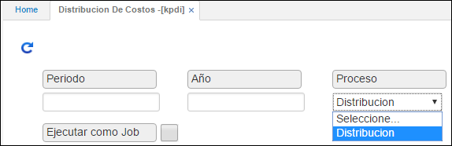

## Distribución de Costos - KPDI

Por medio de este proceso se puede realizar una distribución de costos sobre los diferentes centros de costo que maneja la empresa. Esta distribución se realiza automáticamente de acuerdo a criterios establecidos por la empresa.

Una vez realizadas las parametrizaciones básicas, estamos listos para generar la distribución de costos, este proceso se genera desde la aplicación **KPDI**. Cuando abrimos esta aplicación se despliega una ventana como la que se muestra a continuación:

En ella debemos especificar el periodo y el año para el cual vamos a realizar el proceso de distribución de costos. Pulsamos el botón _consultar_, seguidamente el sistema devuelve un mensaje de proceso terminado.

Cuando se ejecuta el proceso de distribución de costos, se genera un movimiento de contabilidad **KMOV** en estado activo, mediante un documento **NK** concepto **DI** con el último día del mes que se generó. Se debe validar la información generada y proceder a confirmar el documento.

