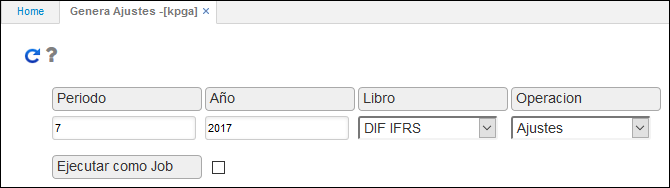

# KPGA - Genera Ajustes

La aplicación KPGA permite la generación de ajustes de contabilidad multiproposito según las normas internacionales que se configuren por cada empresa. Se generan los ajustes manuales que no son calculados automáticamente.  

Entre los ajustes que genera la aplicación KPGA están:  

* Deterioro de cartera
* Descuentos financieros
* Impuesto diferido
* Gasto diferido

Se deberá ingresar el mes y año de generación de ajustes, seleccionar el libro y la operación correspondiente y dar click en el botón _Generar_ .  

**Periodo:** ingresar el periodo del cual se requiere generar los ajustes.  
**Año:** ingresar el año del cual se generan los ajustes.  
**Libro:** seleccionar el libro DIF IFRS.  
**Operación:** seleccionar la operación Ajustes.  

Al dar click en el botón  la aplicación arrojará un mensaje de control indicando que la operación fue exitosa y generará un documento en [**KMOV - Movimientos**](http://docs.oasiscom.com/Operacion/erp/contabilidad/kmovimient/kmov) en el cual relacionará en el detalle los ajustes encontrados por el sistema. Allí se deberán validar y seguidamente procesar el documento para que dichos ajustes sean aplicados a los saldos. (_Ver aplicación KMOV_)

Los saldos ajustados pueden ser validados en diferentes aplicaciones:  

* [Balance de Prueba Ajustado - KRPA](http://docs.oasiscom.com/Operacion/erp/contabilidad/kreporte/krpa)
* [Balance de Prueba Ajustado - KRPA1](http://docs.oasiscom.com/Operacion/erp/contabilidad/kreporte/krpa1)
* [Balance General Ajustado  - KRBA](http://docs.oasiscom.com/Operacion/erp/contabilidad/kreporte/krba)
* [Balance General Ajustado  - KRBA1](http://docs.oasiscom.com/Operacion/erp/contabilidad/kreporte/krba1)
* [Estado de Ganancias y Pérdidas Ajustado - KRGA1](http://docs.oasiscom.com/Operacion/erp/contabilidad/kreporte/krga1)

