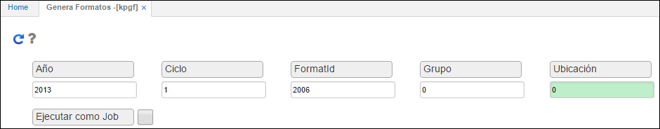
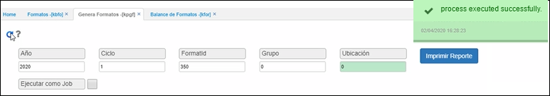
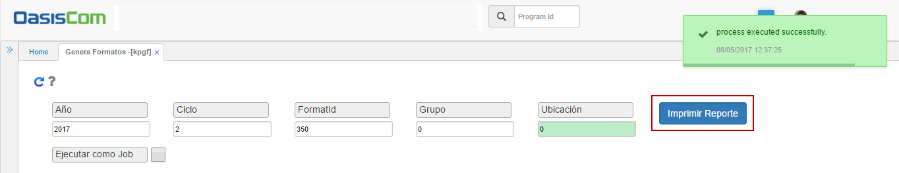
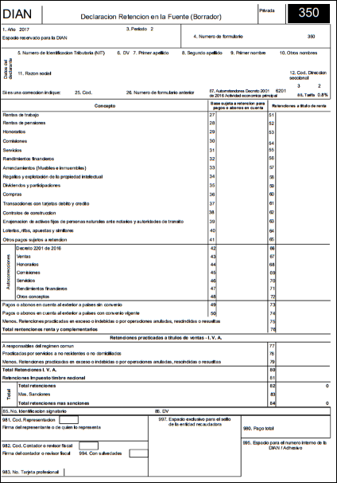

## Genera Formatos - KPGF

La aplicación **KPGF** permite generar los formatos que han sido previamente parametirzados en la aplicación [**KBFO - Formatos**](https://github.com/OasisCom/Docs/blob/master/Operacion/erp/contabilidad/kbasica/kbfo.md).  

Diligenciamos los campos y damos click en botón consultar .  

**Año:** ingresar el año a generar.  
**Ciclo:** se ingresa el ciclo a generar para el año, para el caso de medios magnéticos se debe colocar el número uno (1).  
**Formato:** digitar el número de formato que se va a generar, el número de formato debe estar previamente parametrizado en la aplicación [**KBFO - Formatos**](https://github.com/OasisCom/Docs/blob/master/Operacion/erp/contabilidad/kbasica/kbfo.md).  
**Grupo:** Ingresar grupo 0.  
**Ubicación:** Ingresar la ubicación correspondiente.  

Al dar click en el botón consultar  , el sistema generará el formato y arrojará un mensaje de control indicando que fue creado satisfactoriamente.  

Generado el formato nos dirigimos a la aplicación [**KFOR - Formatos**](https://github.com/OasisCom/Docs/blob/master/Operacion/erp/contabilidad/kformatos/kfor.md) para validar la información.  

## Formato 350 - Retención en la Fuente

Luego de realizar la debida parametrización en la aplicación [**KBFO - Formatos**](https://github.com/OasisCom/Docs/blob/master/Operacion/erp/contabilidad/kbasica/kbfo.md), ingresaremos al proceso especial **KPGF**, el cual nos permite generar el formato ingresando los siguientes datos y dando click en el botón _Generar_ :  

**Año:** año del cual se desea generar la información, ejemplo: 2017.  
**Ciclo:** ciclo en el que se desea correr el formato, en este caso como el formato de retención en la fuente se genera mensual, lo generaremos para el mes de febrero (2).  
**Formato Id:** número de formato que deseamos generar, para este caso sería el 350.  
**Grupo y Ubicación:** por lo general en estos campos se digita 0, ya que siempre se genera para todos los grupos y todas las ubicaciones.  

Al dar click en el botón _Generar_  el sistema habilitará el botón _Imprimir Reporte_.  

Damos click sobre este botón y el proceso KPGF nos generará el formato en una ventana emergente adicional, en este caso es importante descargar el formato en PDF para que se pueda visualizar mejor.  

El formato será descargado en PDF y se podrá observar así:  

