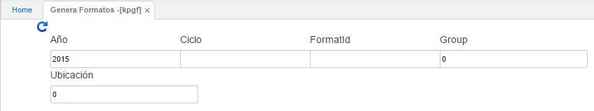

---

layout: default
title: Genera Formatos
permalink: /Operacion/erp/contabilidad/kproceso/kpgf
editable: si

---

## Genera Formatos - KPGF

Cuando ingresamos a esta opción la cual nos genera formatos se despliega una ventana como se muestra en la siguiente gráfica.

**Año:** Ingresar el año a generar.  
**Ciclo:** Se ingresa el ciclo a generar para el año, colocar 1.  
**Formato:** Digitar el número de formato que se va a generar, el número de formato debe estar previamente parametrizado en la aplicación **KFOR**.  
**Ubicación:** Ingresar la ubicación correspondiente.  

Al dar click en el botón consultar, nos arrogará el reporte con la información generada.

