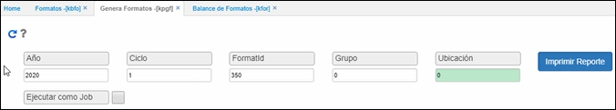
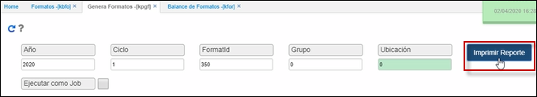
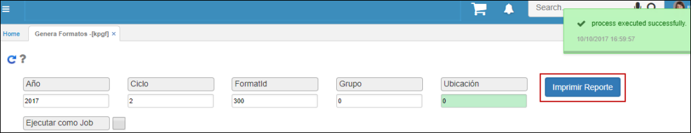
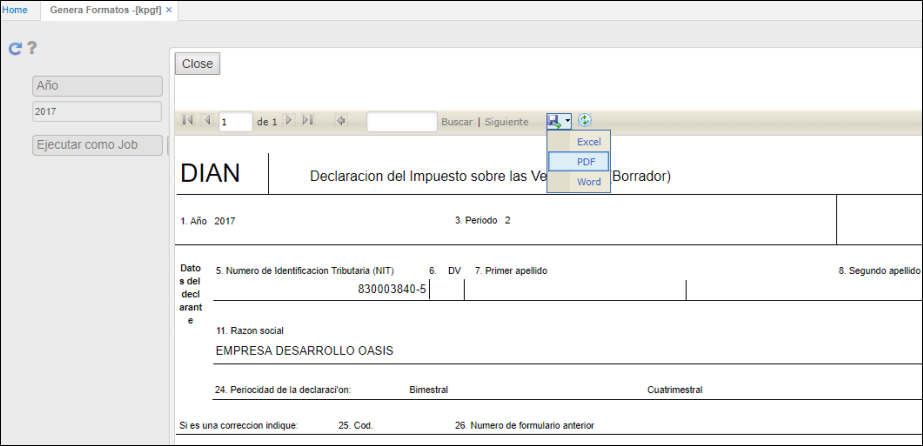
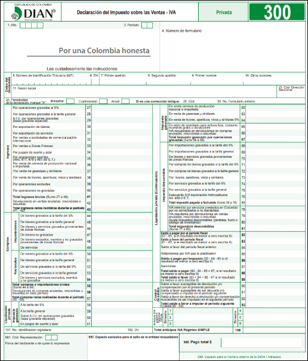
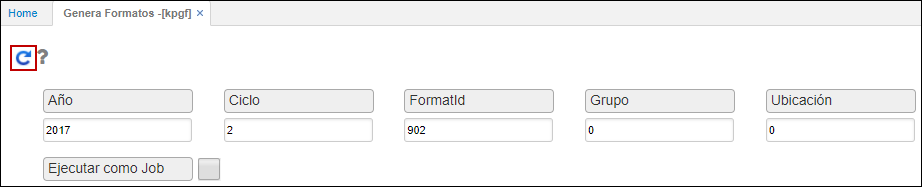
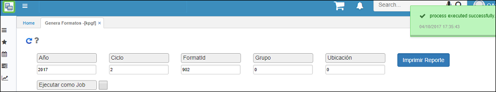
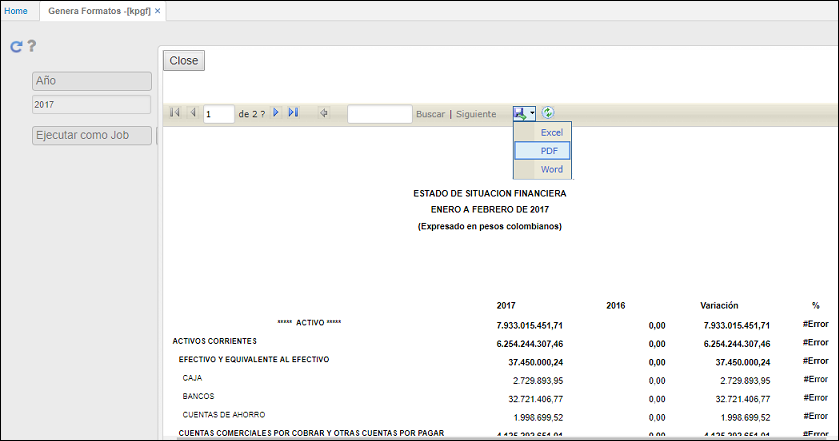
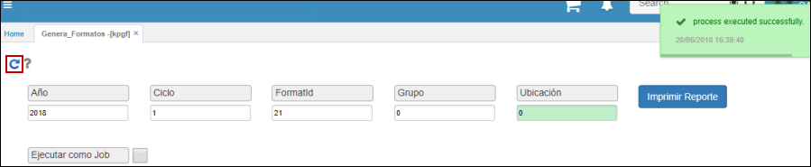

# Genera Formatos - KPGF

La aplicación **KPGF** permite generar los formatos que han sido previamente parametrizados en la aplicación [**KBFO - Formatos**](http://docs.oasiscom.com/Operacion/erp/contabilidad/kbasica/kbfo).  

>+ [Formato 350 - Retención en la Fuente](http://docs.oasiscom.com/Operacion/erp/contabilidad/kproceso/kpgf#formato-350---retención-en-la-fuente)
>+ [Formato 300 - Declaración de IVA](http://docs.oasiscom.com/Operacion/erp/contabilidad/kproceso/kpgf#formato-300---declaración-de-iva)
>+ [Medios magnéticos para el Ingreso de Activo Fijo por Compras](http://docs.oasiscom.com/Operacion/erp/contabilidad/kproceso/kpgf#medios-magnéticos-para-el-ingreso-de-activo-fijo-por-compras)
>+ [Situación Financiera](http://docs.oasiscom.com/Operacion/erp/contabilidad/kproceso/kpgf#situación-financiera)
>+ [Proceso Chip Presupuestal](http://docs.oasiscom.com/Operacion/erp/contabilidad/kproceso/kpgf#proceso-chip-presupuestal)

Diligenciamos los campos y damos clic en botón consultar .  

**Año:** ingresar el año a generar.  
**Ciclo:** se ingresa el ciclo a generar para el año, para el caso de medios magnéticos se debe colocar el número uno (1).  
**Formato:** digitar el número de formato que se va a generar, el número de formato debe estar previamente parametrizado en la aplicación [**KBFO - Formatos**](http://docs.oasiscom.com/Operacion/erp/contabilidad/kbasica/kbfo).  
**Grupo:** Ingresar grupo 0.  
**Ubicación:** Ingresar la ubicación correspondiente.  

Al dar click en el botón consultar  , el sistema generará el formato y arrojará un mensaje de control indicando que fue creado satisfactoriamente.  

Generado el formato nos dirigimos a la aplicación [**KFOR - Formatos**](http://docs.oasiscom.com/Operacion/erp/contabilidad/kformatos/kfor) para validar la información.  

## [Formato 350 - Retención en la Fuente](http://docs.oasiscom.com/Operacion/erp/contabilidad/kproceso/kpgf#formato-350---retención-en-la-fuente)

Luego de realizar la debida parametrización en la aplicación [**KBFO - Formatos**](http://docs.oasiscom.com/Operacion/erp/contabilidad/kbasica/kbfo), ingresaremos al proceso especial **KPGF**, el cual nos permite generar el formato ingresando los siguientes datos y dando click en el botón _Generar_ :  

**Año:** año del cual se desea generar la información, ejemplo: 2020.  
**Ciclo:** ciclo en el que se desea correr el formato, en este caso como el formato de retención en la fuente se genera mensual, lo generaremos para el mes de febrero (2).  
**Formato Id:** número de formato que deseamos generar, para este caso sería el 350.  
**Grupo y Ubicación:** por lo general en estos campos se digita 0, ya que siempre se genera para todos los grupos y todas las ubicaciones.  

Al dar click en el botón _Generar_  el sistema habilitará el botón _Imprimir Reporte_.  

Damos click sobre este botón y el proceso KPGF nos generará el formato en una ventana emergente adicional, en este caso es importante descargar el formato en PDF para que se pueda visualizar mejor.  

El formato será descargado en PDF y se podrá observar así:  

## [Formato 300 - Declaración de IVA](http://docs.oasiscom.com/Operacion/erp/contabilidad/kproceso/kpgf#formato-300---declaración-de-iva)

Luego de realizar la debida parametrización en la aplicación [**KBFO - Formatos**](http://docs.oasiscom.com/Operacion/erp/contabilidad/kbasica/kbfo), ingresaremos al proceso especial **KPGF**, el cual nos permite generar el formato ingresando los siguientes datos y dando click en el botón _Generar_ :  

**Año:** año del cual se desea generar la información, ejemplo: 2017.  
**Ciclo:** ciclo en el que se desea correr el formato, en este caso como el formato de retención en la fuente se genera mensual, lo generaremos para el mes de febrero (2).  
**Formato Id:** número de formato que deseamos generar, para este caso sería el 300.  
**Grupo y Ubicación:** por lo general en estos campos se digita 0, ya que siempre se genera para todos los grupos y todas las ubicaciones.  

Al dar clic en el botón _Generar_  el sistema habilitará el botón _Imprimir Reporte_.  

Damos clic sobre este botón y el proceso KPGF nos generará el formato en una ventana emergente adicional, en este caso es importante descargar el formato en PDF para que se pueda visualizar mejor.  

El formato será descargado en PDF y se podrá observar así:  

## [Medios magnéticos para el Ingreso de Activo Fijo por Compras](http://docs.oasiscom.com/Operacion/erp/contabilidad/kproceso/kpgf#medios-magnéticos-para-el-ingreso-de-activo-fijo-por-compras)

Realizada previamente la parametrización en la aplicación [**KBFO - Formatos**](http://docs.oasiscom.com/Operacion/erp/contabilidad/kbasica/kbfo#parametrización-para-generación-de-medios-magnéticos-correspondientes-al-ingreso-de-activo-fijo-por-compras), procedemos a generar los medios magnéticos en la aplicación KPGF (se ejecutan para el año 2017 en esta prueba, ya que la compra tiene fecha de febrero de 2017).  

Ingresamos los datos de consulta y damos clic en el botón _Imprimir Reporte_.

Generados los medios magnéticos validamos la información que se generó en la aplicación [**KFOR - Balance de Formatos**](http://docs.oasiscom.com/Operacion/erp/contabilidad/kformatos/kfor#verificación-de-la-información-generada-en-los-medios-magnéticos-correspondientes-al-ingreso-de-activo-fijo-por-compras).  

## [Situación Financiera](http://docs.oasiscom.com/Operacion/erp/contabilidad/kproceso/kpgf#situación-financiera)

Mediante la aplicación _KPGF - Genera Formatos_ se puede consultar el reporte de la situación financiera de la empresa, esto de acuerdo a la previa parametrización del formato en la aplicación [**KBFO - Formatos**](http://docs.oasiscom.com/Operacion/erp/contabilidad/kbasica/kbfo#parametrización-estado-situación-financiera). (_Ver aplicación_)  

En la aplicación KPGF ingresamos los datos correspondientes a la parametrización realizada en la aplicación [**KBFO - Formatos**](http://docs.oasiscom.com/Operacion/erp/contabilidad/kbasica/kbfo#parametrización-estado-situación-financiera) y damos clic en el botón .  

El sistema arrojará un mensaje indicando que el proceso se ha ejecutado satisfactoriamente.  

Igualmente, aparecerá el botón , daremos clic en este y el sistema arrojará una ventana con el reporte de la situación financiera de la organización.  

Este reporte también podrá ser descargado en Excel, PDF o Word.  

## [Proceso Chip Presupuestal](http://docs.oasiscom.com/Operacion/erp/contabilidad/kproceso/kpgf#proceso-chip-presupuestal)

Para realizar el proceso de Chip Presupuestal, se debe previamente parametrizar los formatos de programación de gastos, ejecución de gastos, programación de ingresos y ejecución de ingresos en la aplicación [**KBFO Formatos**](http://docs.oasiscom.com/Operacion/erp/contabilidad/kbasica/kbfo#parametrizaci%C3%B3n-formatos-chip-presupuestal) (_Ver aplicación_).  

Parametrizados los formatos, en la aplicación KPGF generaremos la información que almacenará cada formato.  

Consultamos por año, ciclo (periodo), Id del formato a generar (este Id es asignado en la aplicación KBFO al parametrizarlo). Damos clic en el botón _Generar_.  

Para visualizar la información generada ingresamos al formato correspondiente:  

* [**Programación de Gastos - QRP1**](http://docs.oasiscom.com/Operacion/erp/presupuestoo/qreporte/qrp1)
* [**Ejecución de Gastos - QRP2**](http://docs.oasiscom.com/Operacion/erp/presupuestoo/qreporte/qrp2)
* [**Programación de Ingresos - QRP3**](http://docs.oasiscom.com/Operacion/erp/presupuestoo/qreporte/qrp3)
* [**Ejecución de Ingresos - QRP4**](http://docs.oasiscom.com/Operacion/erp/presupuestoo/qreporte/qrp4)
* [**Ejecución General - QRAG**](http://docs.oasiscom.com/Operacion/erp/presupuestoo/qreporte/qrag)

