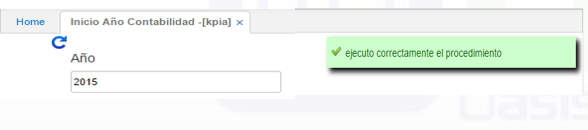

## Inicio Año Contabilidad - KPIA

Cuando se ha cerrado el año, en OasisCom debemos iniciar el nuevo año en los módulos del sistema. Para pasar los saldos de un año a otro el módulo de contabilidad se debe ejecutar el proceso **KPIA**, estos saldos se llevarán al periodo 0 del año en cuestión. Recuerde tener creado este periodo en la aplicación **BPER - Periodos** para ejecutar el proceso de cierre de año de manera correcta.

Teniendo todo debidamente configurado se puede generar el nuevo año contable en la aplicación **KPIA**, ingresando el nuevo año y dando click en el botón consultar , por último, aparecerá el siguiente aviso que nos indicará que se ha ejecutado correctamente el procedimiento.

