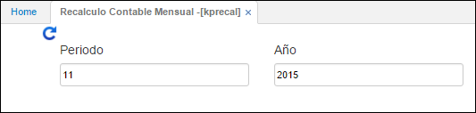

---

layout: default
title: Recálculo Contable Mensual
permalink: /Operacion/erp/contabilidad/kproceso/kprecal
editable: si

---

## Recálculo Contable Mensual - KPRECAL

OasisCom permite realizar este procedimiento cuando los saldos no son correctos de acuerdo a los movimientos que se hayan hecho sobre una cuenta.

Este proceso no se debe ejecutar frecuentemente, puesto que, podría alterar los saldos, por lo tanto es conveniente que solo el personal capacitado lo ejecute en los momentos requeridos.

Para ejecutar este proceso se debe ingresar el periodo y el año en el cual se desea realizar nuevamente el cálculo de los saldos.

