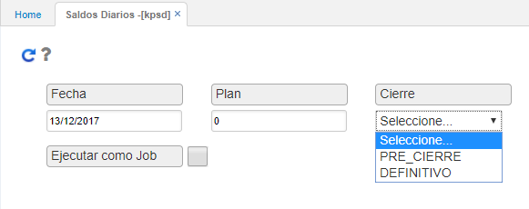

# KPSD - Saldos diarios

La aplicación KPSD permite generar los saldos diarios, teniendo en cuenta los valores del campo cierre en la opción BDIA - Días.  

Ingresamos a la aplicación, diligenciamos los campos y seleccionamos en el campo cierre si es el PRE-CIERRE o el DEFINITIVO.  

Seguidamente, damos click en el botón  para que los saldos sean generados en la aplicación 

