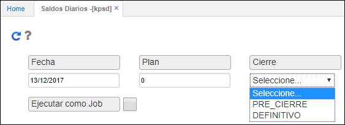

# Saldos diarios - KPSD

La aplicación KPSD permite generar los saldos diarios, teniendo en cuenta los valores del campo cierre en la opción **BDIA - Días.**  

Ingresamos a la aplicación, diligenciamos los campos y seleccionamos en el campo cierre si es el *PRE-CIERRE* o el cierre *DEFINITIVO.*  

Seguidamente, damos clic en el botón  para que los saldos sean generados en la aplicación [**KSSD - Auxiliar por tercero diario**](http://docs.oasiscom.com/Operacion/erp/contabilidad/ksaldo/kssd).(_Ver aplicación_).
