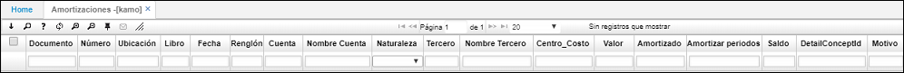

# Amortizaciones - KAMO

En esta aplicación se pueden consultar las diferentes amortizaciones que se han realizado en el sistema.  

**Número:** Consecutivo en el cual se hizo el movimiento.  
**Ubicación:** Identificación numérica de la ubicación que genera el movimiento.  
**Fecha:** Fecha en la cual se realizó el movimiento.  
**Cuenta:** Identificación numérica de la cuenta.  
**Nombre de cuenta:** Nombre de la cuenta registrada anteriormente.  
**Naturaleza:** Naturaleza de la cuenta si es débito o crédito.  
**Tercero:** Identificación numérica del tercero.  
**Nombre del tercero:** Nombre del registrado anteriormente.  
**Centro Costo:** Identificación del centro de costo al que pertenece la cuenta.  
**Valor:** Valor de la cuenta.  
**Amortizado:** Valor amortizado sobre la cuenta.  
**Periodos Amortizar:** Periodos que se deben amortizar.  
**Saldo:** Saldo pendiente por amortizar.  

##  [Cómo realizar el proceso de amortización](http://docs.oasiscom.com/Operacion/erp/contabilidad/krepetitiv/kamo#cómo-realizar-el-proceso-de-amortización)  

Para realizar este proceso, se debe ingresar primero a la aplicación [**Cuentas - BCUE**](http://docs.oasiscom.com/Operacion/common/bcuenta/bcue); en esta aplicación debemos identificar qué cuentas corresponden a este proceso.  Una vez identificadas, activamos el flag en el campo **_Repetitivo_**, al dar click en este flag, definimos a qué cuentas aplica este proceso y a cuales no.  Después de activar el flag a las cuentas correspondientes, debemos diligenciar el campo **_RepetitiveAccount1_** (Cuenta Repetitiva) con la cuenta de contrapartida.  

Una vez realizado este proceso, ingresamos a la aplicación  [**Documentos - BDOC**](http://docs.oasiscom.com/Operacion/common/bsistema/bdoc), donde debemos verificar la parametrización del documento **_NK_** que hace referencia a Nota de Contabilidad.  Este proceso debe afectar el módulo de Contabilidad únicamente de forma positiva, es decir, en el campo **_Contabilidad_**, debe estar seleccionada la opción _Suma_; también debemos verificar que este documento esté relacionado con la aplicación [**Movimientos - KMOV**](http://docs.oasiscom.com/Operacion/erp/contabilidad/kmovimient/kmov) del módulo de _Contabilidad_.  En el campo **_Programa_** se puede ver _KMOV_ y en el campo _Módulo_ se puede ver la letra _K_ de Contabilidad.

