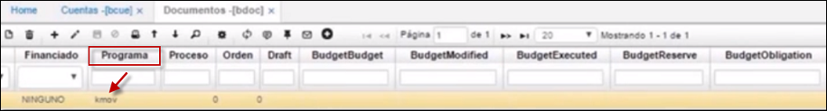
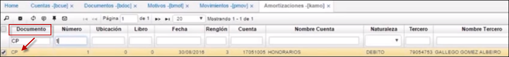
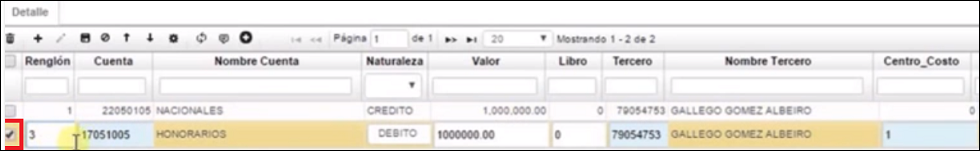
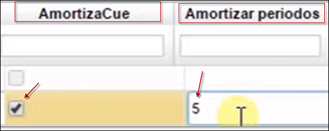
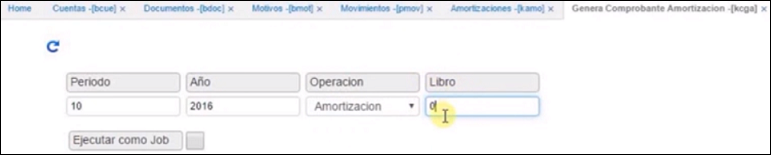
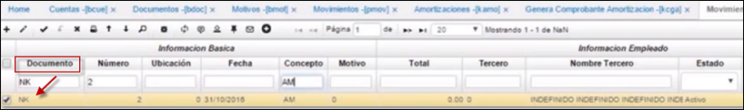
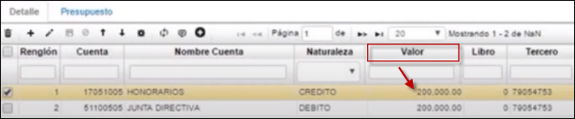

# Amortizaciones - KAMO

En esta aplicación se pueden consultar las diferentes amortizaciones que se han realizado en el sistema.  

**Número:** Consecutivo en el cual se hizo el movimiento.  
**Ubicación:** Identificación numérica de la ubicación que genera el movimiento.  
**Fecha:** Fecha en la cual se realizó el movimiento.  
**Cuenta:** Identificación numérica de la cuenta.  
**Nombre de cuenta:** Nombre de la cuenta registrada anteriormente.  
**Naturaleza:** Naturaleza de la cuenta si es débito o crédito.  
**Tercero:** Identificación numérica del tercero.  
**Nombre del tercero:** Nombre del registrado anteriormente.  
**Centro Costo:** Identificación del centro de costo al que pertenece la cuenta.  
**Valor:** Valor de la cuenta.  
**Amortizado:** Valor amortizado sobre la cuenta.  
**Periodos Amortizar:** Periodos que se deben amortizar.  
**Saldo:** Saldo pendiente por amortizar.  

##  [Cómo realizar el proceso de amortización](http://docs.oasiscom.com/Operacion/erp/contabilidad/krepetitiv/kamo#cómo-realizar-el-proceso-de-amortización)  

Para realizar este proceso, se debe ingresar primero a la aplicación [**Cuentas - BCUE**](http://docs.oasiscom.com/Operacion/common/bcuenta/bcue); en esta aplicación debemos identificar qué cuentas corresponden a este proceso.  Una vez identificadas, activamos el flag en el campo **_Repetitivo_**, al dar click en este flag, definimos a qué cuentas aplica este proceso y a cuales no.  Después de activar el flag a las cuentas correspondientes, debemos diligenciar el campo **_RepetitiveAccount1_** (Cuenta Repetitiva) con la cuenta de contrapartida.  

 

  

Una vez realizado este proceso, ingresamos a la aplicación  [**Documentos - BDOC**](http://docs.oasiscom.com/Operacion/common/bsistema/bdoc), donde debemos verificar la parametrización del documento **_NK_** que hace referencia a Nota de Contabilidad.  Este proceso debe afectar el módulo de Contabilidad únicamente de forma positiva, es decir, en el campo **_Contabilidad_**, debe estar seleccionada la opción _Suma_. También debemos verificar que este documento esté relacionado con la aplicación [**Movimientos - KMOV**](http://docs.oasiscom.com/Operacion/erp/contabilidad/kmovimient/kmov) del módulo de _Contabilidad_.  En el campo **_Programa_** se puede ver _KMOV_ y en el campo _Módulo_ se puede ver la letra _K_ de Contabilidad.  

  

Ahora, se pasa a la parte inferior, al detalle.  Ya parametrizado el documento, se procede a parametrizar el campo **_Concepto_** que en este caso es **_AM_** que corresponde a Amortizaciones.

Realizados estos pasos, continuamos con la aplicación [**Motivos - BMOT**](http://docs.oasiscom.com/Operacion/common/bsistema/bmot) en la cual vamos a crear un motivo correspondiente.  En el campo **_Documento_** **_NK_** que hace referencia a Nota de contabilidad y en el campo **_Concepto_** **_AM_** de Amortización y en el campo **_Motivo_** **_Cero (0)_** de Indefinido.  Es importante tener en cuenta que estas parametrizaciones sólo se deben realizar una vez.  

  
  

Ahora, se debe ingresar a la aplicacion [**Movimientos - PMOV**](http://docs.oasiscom.com/Operacion/erp/cuentas/pmovimient/pmov).  Aquí se crea en el campo **_Documento_** un documento **_CP_** de Cuentas por pagar, y debemos tener en cuenta que en la parte inferior, en el detalle están las cuentas que requieren de amortización, en el ejemplo de la ilustración, está la cuenta 17, seleccionamos la cuenta y luego nos dirigimos al campo **_Amortizar Cuenta_**, donde debemos activar el flag para indicar que esa es la cuenta a la que se le realizará la amortización y también al campo **_Amortizar Periodo_**, aquí, se diligencian los periodos a amortizar.  Ahora se guarda el detalle y se procesa la Cuenta por Pagar .    

  

  

  

  

El siguiente paso es ingresar a la aplicación **Amortización - KAMO**, donde se valida que salga el renglón con la cuenta correspondiente.  Se filtra por el campo **_Documento_** y por el campo **_Número_**. Luego, se va al campo **_Valor_** donde se encuentra el valor de la cuenta que se quiere amortizar, el siguiente campo es **_Amortizado_**, este campo se diligencia automáticamente cuando el sistema genera la amortización.  En el campo **_Amortizar Periodos_** se encuentran el número de periodos que se diligenciaron anteriormente en la **_Cuenta por pagar_**.  

  

Después de verificar estos valores, ingresamos a la aplicación [**Genera Comprobante Amortización - KCGA**](http://docs.oasiscom.com/Operacion/erp/contabilidad/krepetitiv/kcga) en donde se va a generar el proceso de **Amortización**. En esta aplicación se encuentran 4 campos:  **_Periodo_** en donde se diligencia el número correspondiente al mes en el que se generará la amortización; **_Año_**; **_Operación_** donde hay una lista desplegable y en esta se elige la opción **_Amortización_**; **_Libro_**, 1 para IFRS, 0 para Colgaap y 10 para ambos.  Una vez diligenciados estos campos, hacemos clic en la imagen  para generar el proceso de **Amortización**.  

  

Una vez generado el proceso de **Amortización**, ingresamos a la aplicación [**Movimientos - KMOV**](http://docs.oasiscom.com/Operacion/erp/contabilidad/kmovimient/kmov) en donde se puede ver que el sistema generó automáticamente un documento **_NK_** con fecha del último día del mes del periodo en que se generó.  

Como se puede apreciar en la parte inferior, o detalle, en el campo **_Valor_** está para este ejemplo en $200.000, es decir, el valor de la amortización.  

  

Una vez verificada la información, se puede procesar  

  

Ahora, se regresa a la aplicación **KAMO**; aquí se verifica que la **Amortización** se generó exitosamente y el saldo cambió de manera correcta; para el ejemplo, se puede ver que el campo **_Amortizado_** tiene un valor de $200.000,oo y el campo **_Saldo_** tiene un valor de $800.000,oo  

  

Por último, se ingresa a la aplicación [**Movimientos - PMOV**](http://docs.oasiscom.com/Operacion/erp/cuentas/pmovimient/pmov) en donde se puede verificar que los valores de la cuenta 17 (para el ejemplo de la ilustración) cambiaron y en el campo **_Amortizado_**, el valor para el ejemplo está en $200.000 

