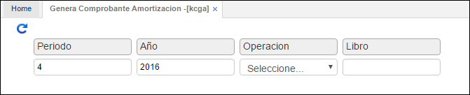
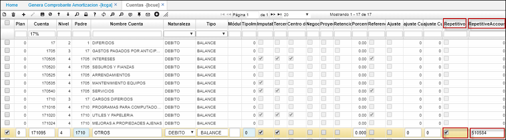
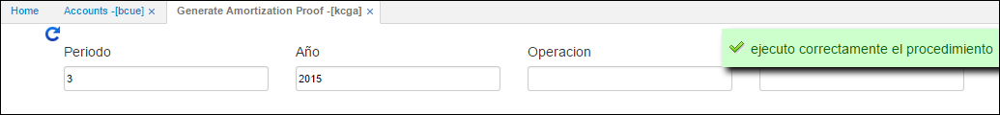

# Genera Comprobante Amortización - KCGA

En esta opción se generan las amortizaciones, el proceso que se lleva a cabo es el de amortizar los diferentes movimientos sobre las cuentas que son susceptibles de amortización, el proceso comienza cuando se confirma  la orden de generar comprobante de amortización en la aplicación **KCGA** en donde se debe ingresar la fecha del comprobante a generar, este proceso se lleva a cabo durante el periodo definido para la cuenta contable, este proceso permite la actualización del movimiento durante  cada periodo de amortización.

Para realizar el proceso de amortizaciones es necesario hacer unas parametrizaciones básicas en la opción [**Cuentas - BCUE**](http://docs.oasiscom.com/Operacion/common/bcuenta/bcue), donde las cuentas, por ejemplo 17 (diferidos), se marcan en el campo **_Repetitivo_** y se parametriza la cuenta de _Gasto_.  

Una vez realizadas estas parametrizaciones básicas podemos realizar el proceso de amortizaciones, en la opción _KCGA - Genera Comprobante de Amortización_. Se debe ingresar el periodo, año, operación, libro a amortizar y pulsamos el botón consultar

Una vez realizado esto, la base retorna el siguiente mensaje.

El procedimiento inserta automáticamente un documento **_NK_** concepto **_AM_** en estado activo en la opción de movimiento en contabilidad [Movimientos - KMOV](http://docs.oasiscom.com/Operacion/erp/contabilidad/kmovimient/kmov), con fecha del último día del periodo amortizado.  

Una vez revisados los valores que realizo el procedimiento, se debe confirmar el documento insertado por el sistema en kmov. Cuando el documento haya sido confirmado se pueden consultar los reportes de amortización, en la misma ruta de la opción anterior (Contabilidad/comprobantes repetitivos) se encuentra la opción kamo. En esta opción podemos ver las amortizaciones que se han realizado.  

En esta opción se pueden observar los periodos a amortizar, el valor total y su respectivo valor amortizado entre otros datos.  

