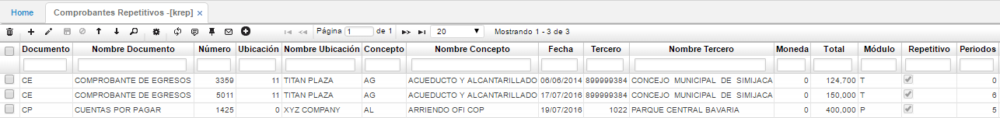

## Comprobantes Repetitivos - KREP

En esta aplicación se generan los comprobantes repetitivos que se han parametrizado.  

Primero, debemos identificar los documentos que se repiten mes a mes, una vez identificados, seleccionamos la fila correspondiente y nos dirigimos al campo repetitivo, en este campo encontramos un flag.

Se debe activar el flag **_Repetitivo_** para los registros que se deseen generar repetidamente e indicar en el campo **_Periodos_** la cantidad de periodos en que se repetirá el documento.  

Terminado este proceso, guardamos nuestra cuenta por pagar.  

Con esta parametrización, el sistema generará una cuenta por pagar en la aplicación [**PMOV - Movimientos**](http://docs.oasiscom.com/Operacion/erp/cuentas/pmovimient/pmov), perteneciente al módulo de Cuentas por pagar

**Documento:** Especificación del documento origen que da comienzo a un movimiento.  
**Número:** Consecutivo en el cual se generó el comprobante.  
**Ubicación:** Identificación numérica de la ubicación de un punto de la empresa.  
**Concepto:** Identificación alfanumérica y nombre del concepto.  
**Fecha:** Fecha en la cual se elaboró el comprobante.  
**Estado:** Estado en el cual se encuentra el comprobante.  
**Renglón:** Número del consecutivo en el cual se encuentra una determinada cuenta de un comprobante.  
**Cuenta:** Identificación numérica y nombre de la cuenta que es afectada por el concepto.  
**Débito:** Si el valor es débito.  
**Crédito:** Si el valor es crédito.  
**Valor:** Valor que es asignado a la cuenta dependiendo de la naturaleza.  
**Tercero:** Identificación numérica del tercero.  
**Centro costo:** Identificación del centro de costo al que pertenece la cuenta.  
**Negocio:** Identificación numérica del tipo de negocio que maneja la empresa.  
**Proyecto:** Identificación numérica del proyecto.  
**BaseRetencion:** Valor de retención que se le aplica a un concepto.  
**Periodo:** Identificación numérica del mes del documento origen.  
**Año:** Año en el que se realiza el documento origen.  

