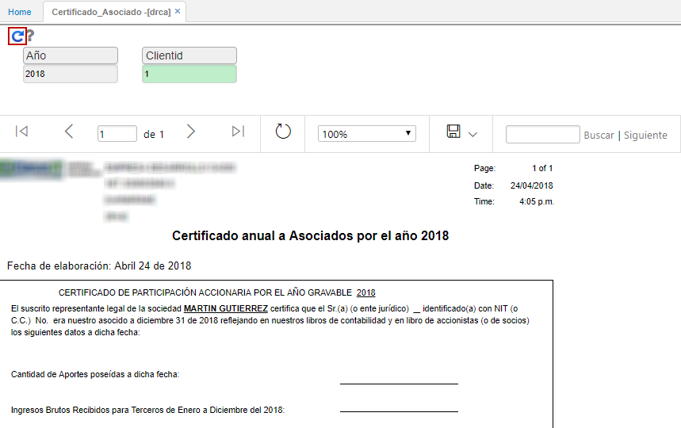
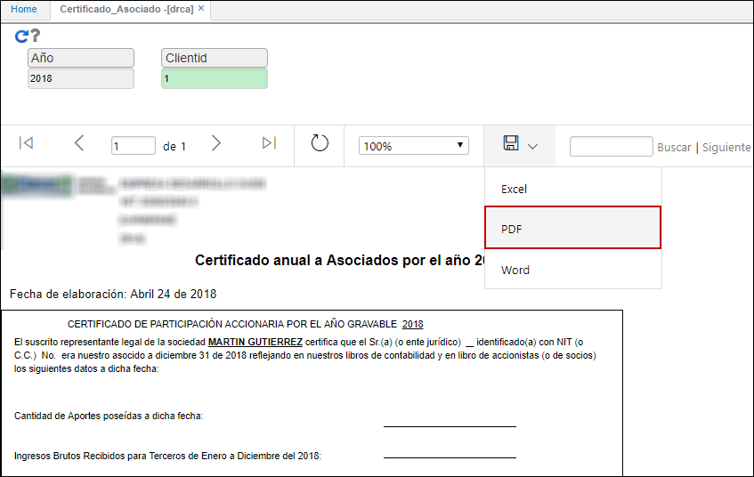
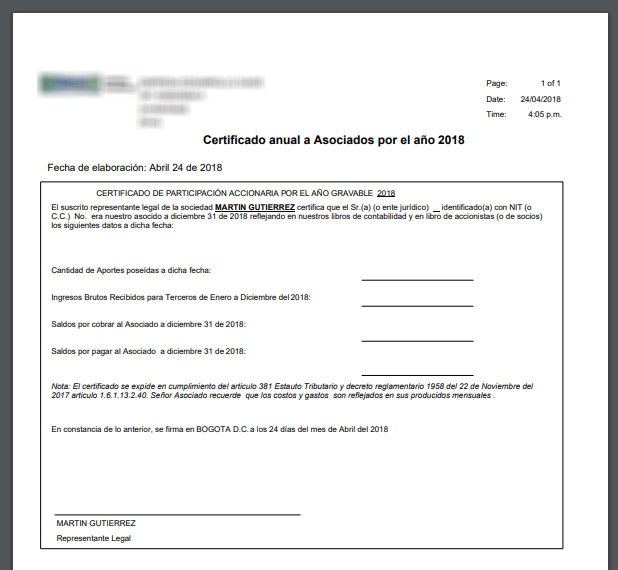

# DRCA - Certificado Asociado

El reporte **DRCA** genera el Certificado Anual de Asociados que muestra información referente a la cantidad de aportes, ingresos y saldos.  

Ingresamos el año y el cliente al cual se le generará el certificado y damos click en el botón .  

El reporte permite ser descargado en formato Word, PDF y Excel.  

Reporte en formato PDF.  

