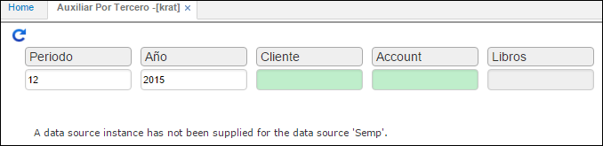

---

layout: default
title: Auxiliar por Tercero
permalink: /Operacion/erp/contabilidad/kreporte/krat
editable: si

---
# Auxiliar por Tercero - KRAT

Esta aplicación es similar a la aplicación **KRAX**, con la diferencia que el reporte que realiza muestra los movimientos por tercero y el **KRAX** genera el reporte basado en los movimientos por cuenta.  

**Periodo:** Mes que se desea consultar.  
**Año:** Año el cual deseo consultar.  
**Cliente:** Número de identificación del tercero que se desea consultar.  
**Cuenta:** Numero de la cuenta a consultar.  

