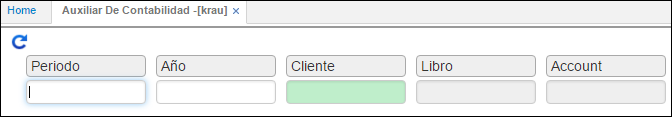

---

layout: default
title: Auxiliar de Contabilidad
permalink: /Operacion/erp/contabilidad/kreporte/krau
editable: si

---

## Auxiliar de Contabilidad - KRAU

Permite generar el libro auxiliar de contabilidad, el cual se puede filtrar por los ítems cliente, libro y cuenta.  

**Periodo:** Mes que se desea consultar.  
**Año:** Año que se desea consultar.  
**Cliente:** Número de identificación del cliente.  
**Libro:** Numero del libro contable a consultar.  
**Cuenta:** Cuenta contable a consultar.  

