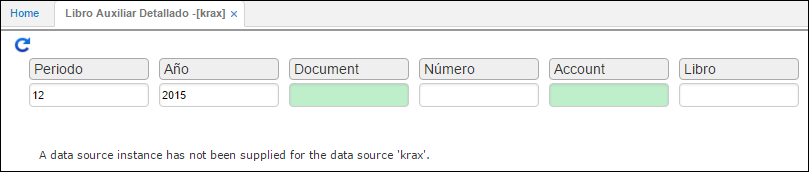
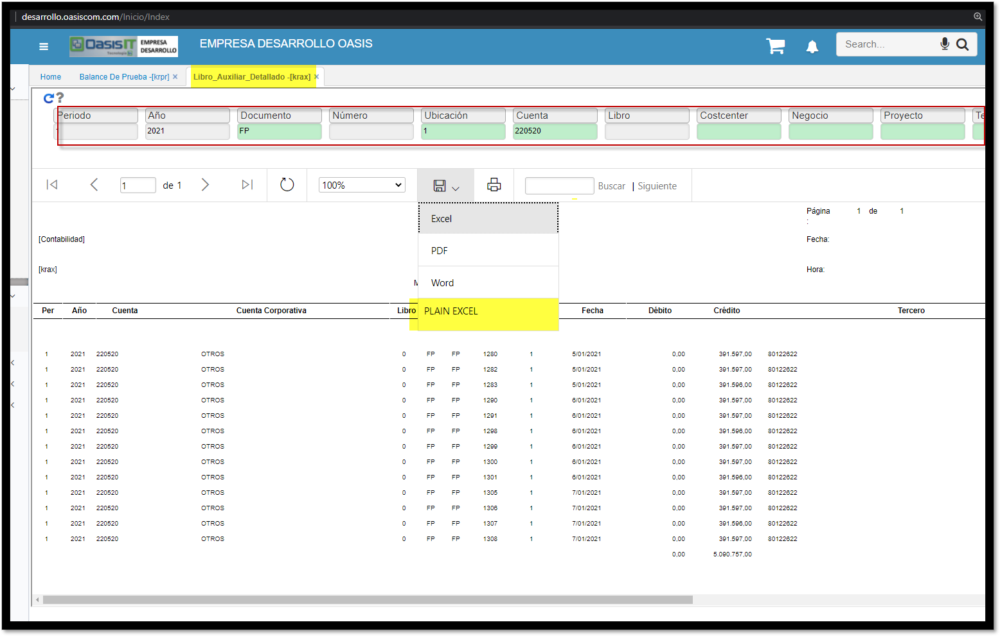

---

layout: default
title: Libro Auxiliar Detallado
permalink: /Operacion/erp/contabilidad/kreporte/krax
editable: si

---

# Libro Auxiliar Detallado - KRAX

Este reporte nos arroja la causación de todos los documentos que afectan al módulo de contabilidad.  

**Periodo:** Mes que se desea consultar.  
**Año:** Año que se desea consultar.  
**Documento:** Documento a consultar.  
**Número:** Número de documento a consultar.  
**Cuenta:** Número de cuenta a consultar.  

## [Reporte Plano en Excel](http://docs.oasiscom.com/Operacion/scm/pos/jcajero/jfac#reporte-plano-excel)

Se encuentra habilitada la opción de exportación de datos de un reporte a un archivo de Excel sin el formato estándar del Reporte. 

Se agrega un nuevo botón ***PLAIN EXCEL*** para obtener la representación en un archivo de Excel de todo el reporte que se está consultando.

Cuando se exporta se genera un archivo plano para poder manipular más fácil los datos exportados desde los reportes

Cuando la cantidad de líneas supera los 100 registros, este se envía al correo electrónico de forma automática. 

En esta parte nos muestra el botón con nombre ***SEND EXCEL*** para obtener la representación en un archivo de Excel al correo electrónico de todo el reporte que se está consultando.

Acá podemos visualizar la recepción del correo electrónico con el reporte como su archivo plano en Excel

***Nota: *** Esta opción se encuentra disponible para todos los reportes dentro de la herramienta de OasisCom.

