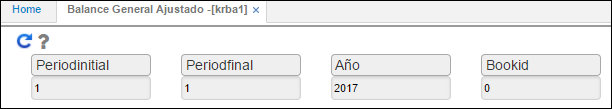

---

layout: default
title: Balance General Ajustado
permalink: /Operacion/erp/contabilidad/kreporte/krba1
editable: si

---

## KRBA1 - Balance General Ajustado

La aplicación **KRBA1** arroja un reporte del balance general donde se comparan los valores del _Libro local_, las _Diferencias_ y su respectivo valor en _IFRS_.  

El reporte permite filtrar por periodo inicial de consulta, periodo final, año y libro contable.  

**Periodo Inicial:** mes inicial de consulta.  
**Periodo Final:** mes final de consulta.  
**Año:** año de consulta.  
**Libro:** ingresar libro contable de consulta. Libro local 0, IFRS 1. Si se desea realizar la búsqueda para ambos libros, no se debe diligenciar nada en el campo.  

Ingresados los datos damos click en el botón _Generar_  y el sistema arrojará el reporte correspondiente.  

OasisCom permite descargar el reporte en formatos Excel, PDF o Word con el fin de facilitar su análisis.  

