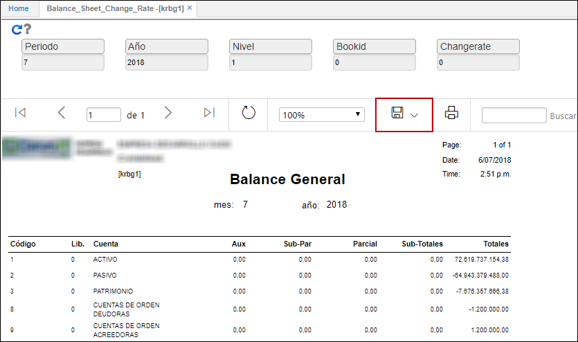
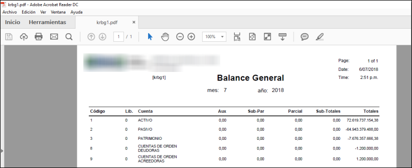

---

layout: default
title: Balance General
permalink: /Operacion/erp/contabilidad/kreporte/krbg1
editable: si

---

# Balance General - KRBG1

Este reporte nos arroja el balance general de la compañía permitiendo filtrar por nivel y libro contable.  

**Periodo:** Mes que se desea consultar.  
**Año:** Año que se desea consultar.  
**Nivel:** De acuerdo con la parametrización del básico de Cuentas **BCUE**.  
**Libro:** De acuerdo con la parametrización del básico de Libros **KLIB**.  
**Tasa de cambio:** ingresar la tasa de cambio por la que se requiere consultar.  

Ingresados los datos damos clic en el botón consultar, como filtramos por nivel 1, veremos solamente las cuentas de activo, pasivo, patrimonio y cuentas de orden deudoras y acreedoras.  

El reporte puede ser extraído en formato de Excel, PDF o Word.  

