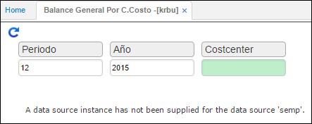

---

layout: default
title: Balance General por Centro de Costo
permalink: /Operacion/erp/contabilidad/kreporte/krbu
editable: si

---

# Balance General por Centro de Costo - KRBU

Esta aplicación realiza el balance general contable, basándose en el centro de costo por el cual se efectué la consulta.  

**Periodo:** Mes que se desea consultar.  
**Año:** Año que se desea consultar.  
**CostCenter:** Cetro de costo.  

