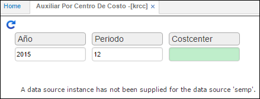

---

layout: default
title: Auxiliar por Centro de Costo
permalink: /Operacion/erp/contabilidad/kreporte/krcc
editable: si

---

# Auxiliar por Centro de Costo - KRCC

La aplicación **KRCC** muestra los movimientos por centro de costo.  

**Periodo:** Mes que se desea consultar.  
**Año:** Año el cual deseo consultar.  
**Centro Costo:** número del Centro de costo.  

