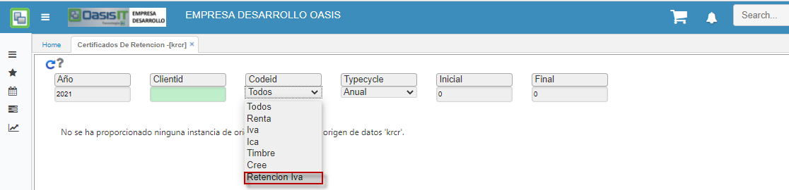

---

layout: default
title: Certificados de Retención
permalink: /Operacion/erp/contabilidad/kreporte/krcr
editable: si

---

# Certificados de Retención - KRCR

La aplicación KRCR permite imprimir el certificado de retención en la fuente según el tercero consultado.  

**Año:** Año correspondiente al certificado que va a emitir.  
**Id Cliente:** Identificación del cliente.  
**Codigo:** Código según el tipo de certificado: Renta, ICA, IVA, CREE o Retención Iva.   

