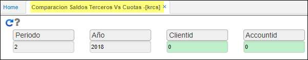
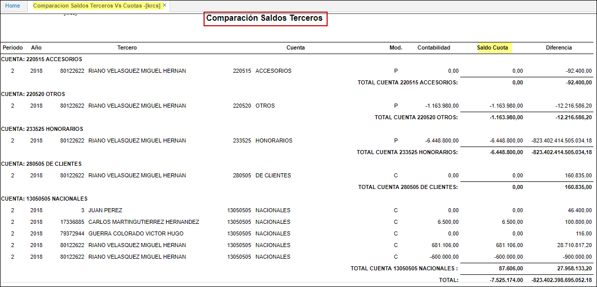

---

layout: default
title: Comparación Saldos Terceros vs. Cuotas
permalink: /Operacion/erp/contabilidad/kreporte/krcs
editable: si

---

#  Comparación Saldos Terceros vs. Cuotas - KRCS
Este reporte **[KRCS]** permite la visualización de comparación contabilidad vs  cuentas por cobrar *(CXC)* y cuentas por pagar *(CXP)* por **tercero**; este permite validar posibles diferencias. 

**Periodo:** Mes que se desea consultar.  
**Año:** Año que se desea consultar.  
**Cliente:** Tercero que esta parametrizado y posee saldo en CXC o CXP.  
**Cuenta:** De acuerdo a la parametrización del básico de Cuentas BCUE.  

Click en el botón consultar.  

