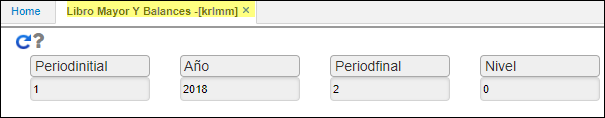

---

layout: default
title: Comparación Saldos Terceros vs. cuotas
permalink: /Operacion/erp/contabilidad/kreporte/krcs
editable: si

---

##  Comparación Saldos Terceros vs. Cuotas - KRCS
Este reporte **[KRCS]** permite la visualización de comparacion contabilidad vs  cuentas por cobrar (CXC) y cuentas por pagar (CXP) por tercero; este permite validar posibles diferencias. 

**Periodo inicial:** rango mes que se desea consultar.  
**Año:** Año que se desea consultar.  
**Periodo Final:** rango mes que se desea consultar.  
**Nivel:** De acuerdo a la parametrización del básico de Cuentas BCUE.  

Click en el botón consultar.  

