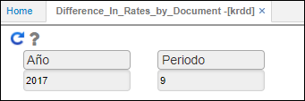
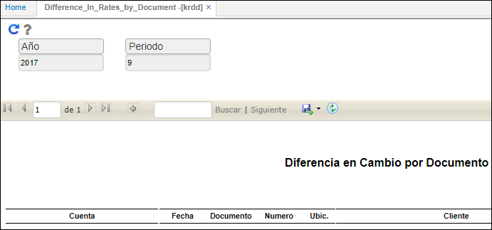

# Diferencia en tasas por documento - KRDD

El reporte **KRDD** brinda soporte de cálculo de la diferencia de tasa de cambio por documento.  

Al ejecutar le proceso el sistema arrojará el reporte correspondiente.  

