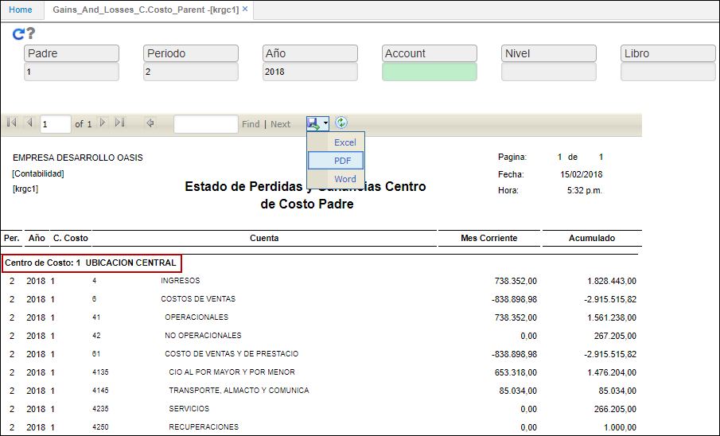

# Estado de Pérdidas y Ganancias Centro de Costo Padre - KRGC1

El reporte **KRGC1** permite visualizar el estado de pérdidas y ganancias por centro de costo padre.

A continuación, consultaremos por Padre 1, correspondiente a la Ubicación Central, periodo 2 y año 2018.  

Al generar el reporte, el sistema nos arrojará la información consultada. El reporte puede ser descargado en formato Excel, PDF o Word.  

