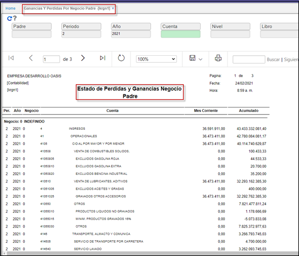

---

layout: default
title: Ganancias Y Perdidas Por Negocio
permalink: /Operacion/erp/contabilidad/kreporte/krgn
editable: si

---

# Ganancias Y Pérdidas Por Negocio - KRGN

Permite realizar el informe de Ganancias y Pérdidas por Negocio **Padre**; con la posibilidad de filtrarlo por un número de cuenta en específico, o realizarlo de manera general.  

**Padre:** Cuenta contable mayor o padre.  
**Periodo:** Mes que se desea consultar.  
**Año:** Año que se desea consultar.  
**Cuenta:** Número de cuenta por la que se desee consultar, parametrizada en el **BCUE**.   
**Nivel:** parametrizada en el **BCUE**.  
**Libro:** parametrizacion realizada en el **KLIB**.  

