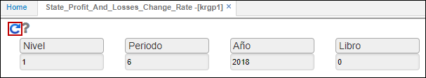
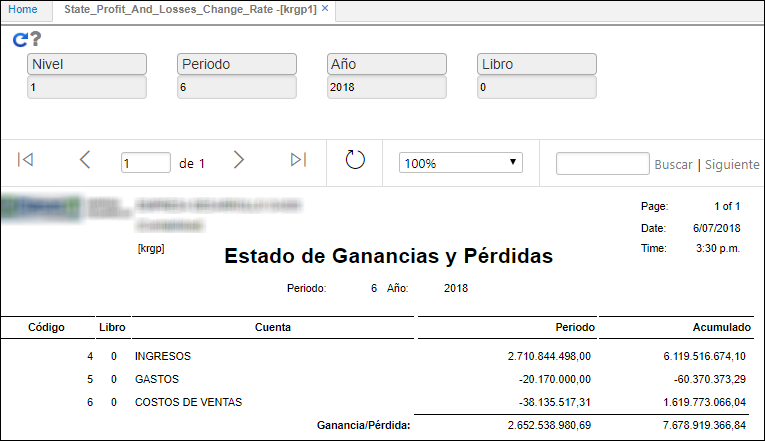

## KRGP1 - Tasa de Cambio de Ganancias y Pérdidas Estatales

Este reporte muestra el estado de ganancias y perdidas por tasa de cambio.  

**Nivel:** ingresar el nivel de las cuentas contables por el cual se desea filtrar.  
**Periodo:** Mes que se desea consultar.  
**Año:** Año que se desea consultar.  
**Libro:** ingresar el libro contrable a consultar.  

Filtrados los datos, damos click en el botón _Generar_. Al filtrar por el nivel 1, vemos sólo las cuentas de ingresos, gastos y costos de ventas.  

