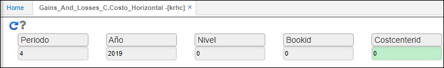
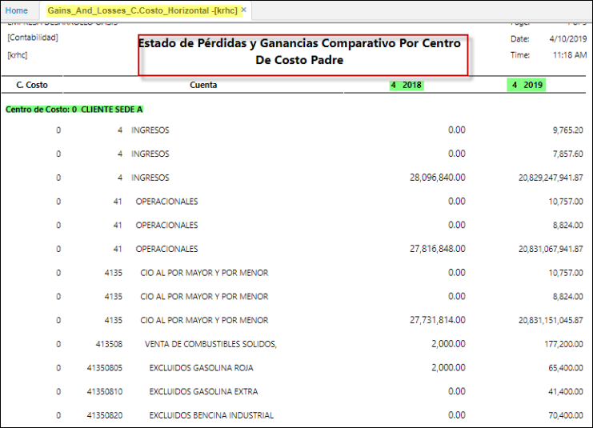

---

layout: default
title: 	
 Estado de Pérdidas y Ganancias Comparativo Por Centro De Costo Padre
permalink: /Operacion/erp/contabilidad/kreporte/krhc
editable: si

---

# 	Estado Ganancias-Perdidas, *Comparativo* Por Centro De Costo *Padre* - KRHC

Reporte de Estado de Ganancias y Pérdidas, que establece un comparativo por el auxiliar centro de costo *padre*.  
Agrupado por centro costo *padre* determina columnas de año-mes comparativos.  
* Filtros de consulta:

**Periodo:** Mes que se desea consultar.  
**Año:** Año que se desea consultar y establece comparativo con el año anterior.  
**Nivel:** De acuerdo a la parametrización del básico de Cuentas -**BCUE**.  
**Libro:** De acuerdo a la parametrización del básico de libros -**KLIB**.  
**Centro de Costo:** según parametrización del  -**BUBI** y básico de Cuentas -**BCUE**.  

* clic en consultar.   

