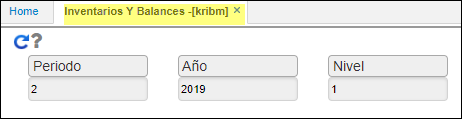

---

layout: default
title: Inventarios y Balances
permalink: /Operacion/erp/contabilidad/kreporte/kribm
editable: si

---

## Inventarios y Balances - KRIBM
Reporte que muestra los estados financieros comparativos entre libros (Multiproposito).
Este informe nos arroja el balance general de la compañía por periodo.  

**Periodo:** Mes que se desea consultar.  
**Año:** Año que se desea consultar.  
**Nivel:** De acuerdo a la parametrización del básico de Cuentas BCUE.  
**Libro:** De acuerdo a la parametrización del básico de Libros KLIB.  

Click en el botón consultar.  

