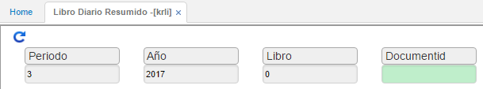

---

layout: default
title: Libro Diario Resumido
permalink: /Operacion/erp/contabilidad/kreporte/krli
editable: si

---

## Libro Diario Resumido - KRLI

Esta aplicación genera un resumen del libro diario contable realiza el balance general contable, basándose en el centro de costo por el cual se efectué la consulta.  

**Periodo:** Mes que se desea consultar.  
**Año:** Año que se desea consultar.  
**Libro:** ingresar el libro del cual se desea realizar la consulta (libro 1 - IFRS, libro 0 - Local).  

