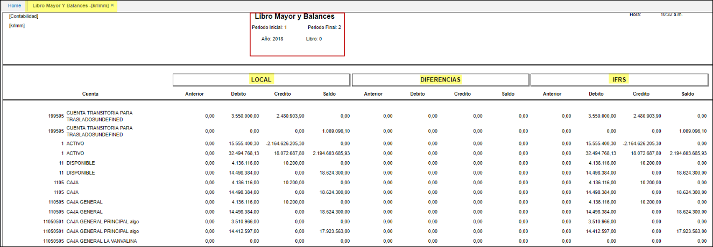

---

layout: default
title: Libro Mayor y Balance
permalink: /Operacion/erp/contabilidad/kreporte/krlmm
editable: si

---

## Libro Mayor y Balance - KRLMM
Este reporte **[KRLMM]** según normas internacionales realiza la diferencia entre IFRS y COLGAP.  
El libro mayor o mayor contable es un libro que recoge todas las operaciones económicas registradas en las distintas cuentas contables de la empresa. 

**Periodo inicial:** rango mes que se desea consultar.  
**Año:** Año que se desea consultar.  
**Periodo Final:** rango mes que se desea consultar.  
**Nivel:** De acuerdo a la parametrización del básico de Cuentas BCUE.  

Click en el botón consultar.  

