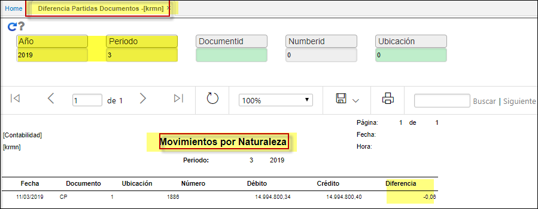

---

layout: default

title: Diferencia partidas documentos  

permalink: /Operacion/erp/contabilidad/kreporte/krmn

editable: si

---

## Diferencia partidas documentos - KRMN  

Reporte que muestra la diferencia entre débitos y créditos de saldos de un mismo documento **KRMN**.  
Se establecen como filtros de búsqueda el año, periodo, tipo de documento el posee el zoom de consulta, numero o consecutivo del documento y ubicación (explorar zoom) del registro.  
Este tipo de reporte es de gran ayuda en hallar diferencias contables: ejemplo cuando sus débitos y créditos en el **KRPR** (Balance de Prueba) no son concordantes; establece cual es el documento que presenta la Diferencia.  

  

**Periodo:** Mes que se desea consultar.  
**Año:**  el cual deseo consultar.  
**Documento:** parametrizacion que se realiza desde el **BDOC**.  
**Numero:** consecutivo del documento.  
**Ubicación:** parametrizacion que se realiza desde el **BUBI**.  

