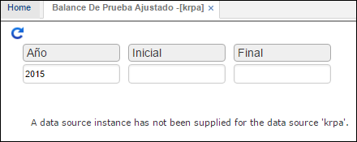

---

layout: default
title: Balance de Pruebas Ejustado
permalink: /Operacion/erp/contabilidad/kreporte/krpa
editable: si

---

## Balance de Pruebas Ajustado - KRPA

Permite mostrar los saldos de las cuentas comparándolos según la normativa colombiana frente a la normativa de IFRS, además muestra el valor de la diferencia entre las dos normativas en una tercera columna.  

