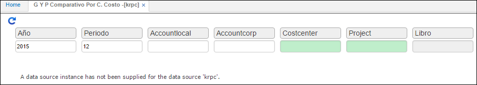

---

layout: default
title: G Y P Comparativo Por C. Costo
permalink: /Operacion/erp/contabilidad/kreporte/krpc
editable: si

---

## G Y P Comparativo Por Centro Costo - KRPC

Genera el balance de prueba por centro de costos, que permite determinar que existe el equilibrio contable para los diferentes registros realizados.  

**Periodo:** Mes que se desea consultar.  
**Año:** Año que se desea consultar.  
**Cuenta local:** Número local de cuenta contable.  
**CuentaCorp:** Número corporativo de cuenta contable.  
**Centro costo:** Centro de costo por el cual se desea consultar.  
**Proyecto:** Código del proyecto.  
**Libro:** Numero de libro contable.  

