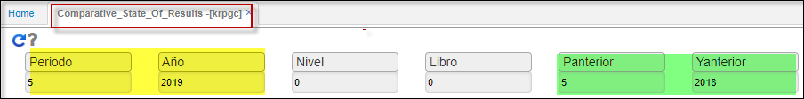
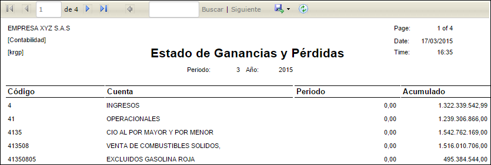

---

layout: default
title: Estado de Perdidas Ganancias Comparativo
permalink: /Operacion/erp/contabilidad/kreporte/krpgc
editable: si

---

## Estado de Perdidas Ganancias Comparativo.  - KRPGC

Reporte anual comparativo de Estado de Ganancias y Perdidas. Ilustra el estado financiero que muestra los ingresos de una organización así como sus gastos, durante un determinado año - periodo **comparativo**.  
También se llama estado de ingresos y egresos, estado de resultados, estado de ingresos y gastos, estado de rendimientos.  

**Periodo:** Mes que se desea consultar.  
**Año:** Año que se desea consultar.  
**Nivel:** De acuerdo a la parametrización del básico de Cuentas **BCUE**.  
**Libro:** De acuerdo a la parametrización del **KLIB**.  
**P_anterior:** Mes anterior, que se desea comparar.  
**Y_Anterior:** Año anterior, que se desea comparar.  
* Ingresar periodo, año y click en consultar.   

